# Family Expense Tracker – System Architecture Document (v0.97.3)

## Introduction

This document defines the full-stack system architecture for the Family Expense Tracker (aligned with PRD v0.97.3), incorporating the new navigation structure, Fund/Wallet management system, Line-like chat functionality, enhanced categorization, and personalization features while maintaining all existing architectural components.

**Relationship to Frontend Architecture:** This project includes a significant user interface, so a separate Frontend Architecture Document will detail the frontend-specific design and MUST be used in conjunction with this document.

### Change Log

| Date       | Version | Description                                                                                 | Author          |
| ---------- | ------- | ------------------------------------------------------------------------------------------- | --------------- |
| 2025-09-10 | 0.94.0  | Initial architecture foundation                                                             | Architect Agent |
| 2025-09-14 | 0.96.0  | Major update: PRD v0.96.0 enhancements                                                      | Architect Agent |
| 2025-09-15 | 0.96.1  | Enhanced with source tree, diagrams, and dependency flows                                   | Architect Agent |
| 2025-09-15 | 0.96.2  | Merged and updated with latest PRD requirements                                             | Architect Agent |
| 2025-09-15 | 0.97.0  | Updated for PRD v0.97.1 with new navigation and features                                    | Architect Agent |
| 2025-09-21 | 0.97.3  | Added user story to component mapping, enhanced error handling, and updated for PRD v0.97.3 | Architect Agent |

## High Level Architecture

### Technical Summary

The Family Expense Tracker is a full-stack application built with Next.js frontend and NestJS backend, using PostgreSQL as primary database with MongoDB for gamification and Redis for caching. The architecture follows a modular monolith pattern with clear service boundaries. Version 0.97.3 adds comprehensive navigation structure with Home, Overview, Payment, Chat, and My Center sections, Fund/Wallet management system, Line-like chat functionality, enhanced categorization, and personalization features while maintaining all existing functionality.

### High Level Project Diagram


### Navigation Architecture Diagram

```mermaid
graph TD
    App[Family Expense Tracker App] --> Home[🏠 Home Navigation]
    App --> Overview[📊 Overview Navigation]
    App --> Payment[💳 Payment Navigation]
    App --> ChatNav[💬 Chat Navigation]
    App --> MyCenter[👤 My Center Navigation]
    
    Home --> EP0[Epic 0: Account Creation & Onboarding]
    Home --> EP13[Epic 13: Personalization & Theme System]
    Home --> EP14[Epic 14: Home Screen Fund/Wallet Management]
    
    Overview --> EP15[Epic 15: Fund Management System]
    Overview --> EP16[Epic 16: Wallet Management System]
    Overview --> EP2[Epic 2: Group Management & Dashboard]
    
    Payment --> EP3[Epic 3: Core Expense Management]
    Payment --> EP17[Epic 17: Comprehensive Categorization System]
    Payment --> EP4[Epic 4: Goals & Savings]
    Payment --> EP5[Epic 5: Allowances & Chores]
    Payment --> EP11[Epic 11: Calendar & Scheduling]
    Payment --> EP12[Epic 12: Multi-Currency Management]
    Payment --> EP9[Epic 9: Pricing & Subscription]
    
    ChatNav --> EP18[Epic 18: Line-like Messaging System]
    ChatNav --> EP10[Epic 10: Feedback & Customer Support]
    
    MyCenter --> EP1[Epic 1: Authentication & Security]
    MyCenter --> EP8[Epic 8: Multi-Language & RWD]
    MyCenter --> EP6[Epic 6: Gamification & Education]
    MyCenter --> EP7[Epic 7: Advanced Notifications & Controls]
```



### System Block Diagram with New Components


### Architectural and Design Patterns

- **API-First Design**: RESTful APIs with OpenAPI specification
- **Repository Pattern**: Abstract data access through repository interfaces
- **Strategy Pattern**: For bank integration and currency exchange providers
- **Observer Pattern**: For real-time balance updates, calendar events, and notifications
- **Factory Pattern**: For multi-language content generation and currency formatting
- **Decorator Pattern**: For currency conversion across financial operations
- **Command Pattern**: For scheduled calendar events and recurring transactions
- **Publisher-Subscriber Pattern**: For real-time chat messaging and notifications
- **Composite Pattern**: For Fund/Wallet hierarchy and management
- **State Pattern**: For theme and personalization state management

## Processing Flow Chart with Enhanced Navigation

```mermaid
flowchart LR
    Start([User Action]) --> Nav[Navigation Service]
    Nav --> Home[🏠 Home Screen]
    Nav --> Overview[📊 Overview Screen]
    Nav --> Payment[💳 Payment Screen]
    Nav --> Chat[💬 Chat Screen]
    Nav --> MyCenter[👤 My Center Screen]
    
    Home --> FundWallet[Fund/Wallet Management]
    Overview --> FundMgmt[Fund Operations]
    Overview --> WalletMgmt[Wallet Operations]
    
    Payment --> ExpenseFlow[Expense Management]
    Payment --> BankSync[Bank Integration]
    Payment --> CalendarView[Calendar & Scheduling]
    Payment --> CurrencyMgmt[Multi-Currency]
    
    Chat --> Messaging[Real-time Chat]
    Chat --> Feedback[Feedback System]
    
    MyCenter --> AuthFlow[Authentication]
    MyCenter --> Settings[User Settings]
    MyCenter --> Personalization[Theme Customization]
    
    %% Connect to existing flows
    ExpenseFlow --> Existing[Existing Processing Flow]
    BankSync --> Existing
    CalendarView --> Existing
    CurrencyMgmt --> Existing
    AuthFlow --> Existing
    
    Existing --> End([Completion])
```



## Epic & Story Dependency Flow with New Structure


## Tech Stack

### Cloud Infrastructure

- **Provider**: AWS (Amazon Web Services)
- **Key Services**: EC2, RDS, S3, CloudFront, Lambda, SNS, SES, Elasticache
- **Deployment Regions**: us-east-1 (Primary), eu-west-1 (Secondary)

### Technology Stack Table

| Category                    | Technology      | Version    | Purpose                   | Rationale                                                      |
| --------------------------- | --------------- | ---------- | ------------------------- | -------------------------------------------------------------- |
| **Frontend Framework**      | Next.js         | 14.0.0     | React framework with SSR  | Excellent i18n support, API routes, optimized performance      |
| **UI Library**              | React           | 18.2.0     | Component library         | Industry standard, extensive ecosystem                         |
| **Backend Runtime**         | Node.js         | 20.11.0    | Server-side JavaScript    | LTS version, async capabilities, team expertise                |
| **Backend Framework**       | NestJS          | 10.0.0     | API framework             | TypeScript support, modular architecture, dependency injection |
| **Database**                | PostgreSQL      | 15.0       | Primary data store        | ACID compliance, JSON support, financial data integrity        |
| **ORM**                     | Prisma          | 5.0.0      | Database client           | Type safety, migrations, excellent DX                          |
| **Caching**                 | Redis           | 7.0.0      | Session storage & caching | High performance, pub/sub capabilities                         |
| **Real-time Communication** | Socket.IO       | 4.7.0      | WebSocket implementation  | Real-time chat and notifications                               |
| **Authentication**          | JWT             | 9.0.0      | Token-based auth          | Stateless, scalable, industry standard                         |
| **Bank Integration**        | Plaid API       | 2020-09-14 | Bank data connectivity    | Global coverage, reliable API                                  |
| **Bank Integration**        | Tink API        | 2.0.0      | European bank integration | Strong EU presence, PSD2 compliant                             |
| **Bank Integration**        | TrueLayer       | 2.0.0      | UK bank integration       | Open banking specialist, UK coverage                           |
| **Bank Integration**        | SaltEdge API    | 5.0.0      | Global bank integration   | Extended global coverage                                       |
| **Currency Exchange**       | ExchangeRateAPI | 1.0.0      | Real-time exchange rates  | Reliable currency data provider                                |
| **Internationalization**    | next-i18next    | 13.0.0     | Multi-language support    | Next.js integration, SSR compatible                            |
| **Styling**                 | Tailwind CSS    | 3.3.0      | Utility-first CSS         | Responsive design, rapid development                           |
| **UI Components**           | shadcn/ui       | 0.8.0      | Component library         | Accessible, customizable components                            |
| **Testing**                 | Jest            | 29.0.0     | Testing framework         | Comprehensive testing, snapshot support                        |
| **E2E Testing**             | Playwright      | 1.38.0     | Browser testing           | Cross-browser, reliable automation                             |
| **Deployment**              | Docker          | 20.10.0    | Containerization          | Environment consistency, scaling                               |
| **CI/CD**                   | GitHub Actions  | -          | Automation                | GitHub integration, flexible workflows                         |

## Data Models

### User Model
**Purpose:** Store user account information and preferences

**Key Attributes:**
- `id`: UUID - Primary identifier
- `email`: String - Unique login identifier
- `password_hash`: String - Hashed password
- `name`: String - Display name
- `role`: Enum(Parent, Partner, Teen, Child) - System role
- `language`: Enum(EN, ZH-TW, ZH-CN, JA, ES) - Preference
- `currency`: String - Default currency code
- `theme_preference`: String - Selected theme
- `dark_mode`: Boolean - Dark mode preference

**Relationships:**
- Belongs to a Family
- Has many Expenses
- Has many Contributions
- Has many Wallets
- Has many ChatMessages

### Family Model
**Purpose:** Represent family groups and their configuration

**Key Attributes:**
- `id`: UUID - Primary identifier
- `name`: String - Family display name
- `invite_code`: String - Unique invitation code
- `subscription_tier`: Enum(Free, Premium) - Payment status
- `default_currency`: String - Family currency setting

**Relationships:**
- Has many Users
- Has many Expenses
- Has many Goals
- Has many Funds
- Has many ChatChannels

### Fund Model (NEW)
**Purpose:** Manage shared family funds for specific purposes

**Key Attributes:**
- `id`: UUID - Primary identifier
- `name`: String - Fund name (e.g., "Dinner Fund", "Trip Fund")
- `purpose`: String - Fund purpose description
- `target_amount`: Decimal - Target amount for the fund
- `current_balance`: Decimal - Current balance in the fund
- `currency`: String - Currency code
- `is_shared`: Boolean - Whether fund is shared among family members
- `contribution_rules`: JSONB - Rules for contributing to the fund

**Relationships:**
- Belongs to a Family
- Has many FundContributions
- Has many FundExpenses

### Wallet Model (NEW)
**Purpose:** Manage individual financial tracking envelopes

**Key Attributes:**
- `id`: UUID - Primary identifier
- `name`: String - Wallet name (e.g., "Travel Wallet", "Food Wallet")
- `purpose`: String - Wallet purpose description
- `allocated_amount`: Decimal - Budget allocated to this wallet
- `current_balance`: Decimal - Current balance in the wallet
- `currency`: String - Currency code
- `wallet_type`: Enum(Cash, Digital, Savings) - Type of wallet
- `spending_limit`: Decimal - Optional spending limit

**Relationships:**
- Belongs to a User
- Has many WalletTransactions
- Has many BudgetAlerts

### Expense Model
**Purpose:** Track financial transactions within the family

**Key Attributes:**
- `id`: UUID - Primary identifier
- `amount`: Decimal - Transaction amount
- `currency`: String - Currency code
- `description`: String - Transaction description
- `category`: Enum(Food, Transportation, Entertainment, etc.) - Spending category
- `subcategory`: String - More specific category
- `date`: DateTime - Transaction date
- `type`: Enum(Expense, Income, Transfer) - Transaction type
- `recurring`: Boolean - Is recurring expense
- `recurring_schedule`: JSON - Cron-like schedule definition
- `fund_id`: UUID - Optional reference to Fund
- `wallet_id`: UUID - Optional reference to Wallet

**Relationships:**
- Belongs to a User (payer)
- Belongs to a Family
- Optional connection to BankTransaction
- Optional connection to Fund
- Optional connection to Wallet

### ChatChannel Model (NEW)
**Purpose:** Manage chat channels for family communication

**Key Attributes:**
- `id`: UUID - Primary identifier
- `name`: String - Channel name
- `description`: String - Channel description
- `channel_type`: Enum(Family, Group, Direct) - Type of channel
- `is_private`: Boolean - Private channel flag
- `created_by`: UUID - User who created the channel

**Relationships:**
- Belongs to a Family
- Has many ChatMessages
- Has many ChannelMembers

### ChatMessage Model (NEW)
**Purpose:** Store chat messages with various content types

**Key Attributes:**
- `id`: UUID - Primary identifier
- `content`: Text - Message content
- `message_type`: Enum(Text, Voice, Image, Video, Document) - Message type
- `media_url`: String - URL for media content
- `media_metadata`: JSONB - Metadata for media files
- `is_edited`: Boolean - Message edited flag
- `edited_at`: DateTime - When message was edited
- `replied_to_id`: UUID - Reference to replied message
- `read_by`: JSONB - Tracking who read the message

**Relationships:**
- Belongs to a ChatChannel
- Belongs to a User (sender)
- Has many Reactions

### ThemePreference Model (NEW)
**Purpose:** Store user theme and personalization preferences

**Key Attributes:**
- `id`: UUID - Primary identifier
- `user_id`: UUID - Reference to user
- `theme_name`: String - Selected theme name
- `color_scheme`: JSONB - Custom color scheme
- `font_preference`: String - Preferred font
- `layout_preference`: JSONB - UI layout preferences
- `home_screen_layout`: JSONB - Home screen arrangement

**Relationships:**
- Belongs to a User

### CategoryModel (NEW)
**Purpose:** Manage income and expenditure categorization system

**Key Attributes:**
- `id`: UUID - Primary identifier
- `name`: String - Category name
- `type`: Enum(Income, Expense) - Category type
- `parent_id`: UUID - Optional parent category
- `is_system`: Boolean - System-defined category
- `icon`: String - Category icon
- `color`: String - Category color
- `budget_default`: Decimal - Default budget amount

**Relationships:**
- Has many Subcategories
- Has many Expenses

### BankTransaction Model
**Purpose:** Store synced bank transactions

**Key Attributes:**
- `id`: UUID - Primary identifier
- `bank_id`: String - Provider's transaction ID
- `amount`: Decimal - Transaction amount
- `currency`: String - Currency code
- `description`: String - Original description
- `date`: DateTime - Transaction date
- `category`: String - Bank-provided category
- `merchant`: String - Merchant information
- `sync_status`: Enum(Pending, Matched, Ignored) - Reconciliation status

**Relationships:**
- Belongs to a User
- Optional connection to Expense

### Goal Model
**Purpose:** Track family savings goals

**Key Attributes:**
- `id`: UUID - Primary identifier
- `name`: String - Goal name
- `target_amount`: Decimal - Target amount
- `current_amount`: Decimal - Current savings
- `deadline`: DateTime - Target date
- `currency`: String - Currency code

**Relationships:**
- Belongs to a Family
- Has many Contributions

### CalendarEvent Model
**Purpose:** Store calendar events and scheduled financial activities

**Key Attributes:**
- `id`: UUID - Primary identifier
- `title`: String - Event title
- `description`: String - Event description
- `start_date`: DateTime - Event start date
- `end_date`: DateTime - Event end date
- `recurring`: Boolean - Is recurring event
- `recurring_pattern`: JSON - Recurrence pattern (daily, weekly, monthly, yearly)
- `event_type`: Enum(Expense, Income, Allowance, Chore, Goal) - Event category
- `linked_transaction_id`: UUID - Optional linked transaction ID

**Relationships:**
- Belongs to a Family
- Belongs to a User (creator)

### CurrencyExchange Model
**Purpose:** Store exchange rate history and conversions

**Key Attributes:**
- `id`: UUID - Primary identifier
- `base_currency`: String - Base currency code
- `target_currency`: String - Target currency code
- `exchange_rate`: Decimal - Conversion rate
- `timestamp`: DateTime - Rate timestamp
- `source`: String - API source
- `is_active`: Boolean - Current rate status

**Relationships:**
- Has many Expense conversions

## Components

### Navigation Service (NEW)
**Responsibility:** Handle application navigation structure and routing
**User Stories:** Epic 2.1, Epic 2.7, Epic 14.1, Epic 14.2, Epic 14.3, Epic 14.4, Epic 14.5
**Key Interfaces:**
- `GET /api/navigation/structure` - Get navigation structure
- `GET /api/navigation/items` - Get navigation items for user
- `POST /api/navigation/preferences` - Save navigation preferences
- `GET /api/navigation/context` - Get navigation context

**Dependencies:** User Repository, Family Repository, Redis Cache
**Technology Stack:** NestJS, Redis, JWT

### Fund Management Service (NEW)
**Responsibility:** Handle shared family fund operations
**User Stories:** Epic 15.1, Epic 15.2, Epic 15.3, Epic 15.4, Epic 15.5
**Key Interfaces:**
- `POST /api/funds` - Create new fund
- `GET /api/funds` - List family funds
- `PUT /api/funds/:id` - Update fund
- `POST /api/funds/:id/contributions` - Add contribution to fund
- `POST /api/funds/:id/transfers` - Transfer between funds/wallets
- `GET /api/funds/:id/history` - Get fund history

**Dependencies:** Fund Repository, User Repository, Transaction Service
**Technology Stack:** NestJS, Prisma, Decimal.js

### Wallet Management Service (NEW)
**Responsibility:** Handle individual wallet operations
**User Stories:** Epic 16.1, Epic 16.2, Epic 16.3, Epic 16.4, Epic 16.5
**Key Interfaces:**
- `POST /api/wallets` - Create new wallet
- `GET /api/wallets` - List user wallets
- `PUT /api/wallets/:id` - Update wallet
- `POST /api/wallets/:id/allocations` - Allocate budget to wallet
- `POST /api/wallets/:id/transfers` - Transfer between wallets
- `GET /api/wallets/:id/transactions` - Get wallet transactions

**Dependencies:** Wallet Repository, User Repository, Budget Service
**Technology Stack:** NestJS, Prisma, Decimal.js

### Chat Service (NEW)
**Responsibility:** Handle real-time messaging functionality
**User Stories:** Epic 18.1, Epic 18.2, Epic 18.3, Epic 18.4, Epic 18.5, Epic 18.6, Epic 18.7, Epic 18.8, Epic 18.9
**Key Interfaces:**
- `GET /api/chat/channels` - List user channels
- `POST /api/chat/channels` - Create new channel
- `GET /api/chat/channels/:id/messages` - Get channel messages
- `POST /api/chat/channels/:id/messages` - Send message
- `PUT /api/chat/messages/:id` - Edit message
- `DELETE /api/chat/messages/:id` - Delete message
- `POST /api/chat/messages/:id/reactions` - Add reaction
- `WS /chat` - WebSocket endpoint for real-time messaging

**Dependencies:** Chat Repository, User Repository, WebSocket Service
**Technology Stack:** NestJS, Socket.IO, Redis Pub/Sub

### Theme Service (NEW)
**Responsibility:** Handle theme and personalization features
**User Stories:** Epic 13.1, Epic 13.2, Epic 13.3, Epic 13.4, Epic 13.5
**Key Interfaces:**
- `GET /api/themes` - Get available themes
- `POST /api/themes/active` - Set active theme
- `GET /api/themes/custom` - Get custom themes
- `POST /api/themes/custom` - Create custom theme
- `PUT /api/themes/custom/:id` - Update custom theme
- `GET /api/themes/preferences` - Get theme preferences

**Dependencies:** Theme Repository, User Repository, Redis Cache
**Technology Stack:** NestJS, Redis, CSS-in-JS

### Categorization Service (NEW)
**Responsibility:** Manage income and expenditure categories
**User Stories:** Epic 17.1, Epic 17.2, Epic 17.3, Epic 17.4, Epic 17.5
**Key Interfaces:**
- `GET /api/categories` - Get category hierarchy
- `POST /api/categories` - Create new category
- `PUT /api/categories/:id` - Update category
- `DELETE /api/categories/:id` - Delete category
- `GET /api/categories/system` - Get system categories
- `POST /api/categories/import` - Import categories

**Dependencies:** Category Repository, Expense Repository
**Technology Stack:** NestJS, Prisma

### Authentication Service
**Responsibility:** Handle user registration, login, and session management
**User Stories:** Epic 0.1, Epic 0.2, Epic 0.3, Epic 0.4, Epic 0.5, Epic 0.6, Epic 1.1, Epic 1.2, Epic 1.3, Epic 1.4, Epic 1.5, Epic 1.6
**Key Interfaces:**
- `POST /api/auth/register` - User registration
- `POST /api/auth/login` - User login
- `POST /api/auth/logout` - User logout
- `POST /api/auth/refresh` - Token refresh

**Dependencies:** User Repository, JWT Service, Email Service
**Technology Stack:** NestJS, JWT, bcrypt, Redis

### Expense Management Service
**Responsibility:** Handle CRUD operations for expenses and balance calculations
**User Stories:** Epic 3.1, Epic 3.2, Epic 3.3, Epic 3.4, Epic 3.5, Epic 3.6
**Key Interfaces:**
- `GET /api/expenses` - List expenses with filters
- `POST /api/expenses` - Create new expense
- `PUT /api/expenses/:id` - Update expense
- `DELETE /api/expenses/:id` - Delete expense
- `GET /api/balance` - Get current user balance

**Dependencies:** Expense Repository, User Repository, Notification Service
**Technology Stack:** NestJS, Prisma, Decimal.js

### Bank Integration Service
**Responsibility:** Handle connections to bank API providers and transaction syncing
**User Stories:** Epic 3.4
**Key Interfaces:**
- `GET /api/bank/providers` - List available providers by region
- `POST /api/bank/connect` - Initiate bank connection
- `GET /api/bank/transactions` - Get synced transactions
- `POST /api/bank/transactions/match` - Match transaction to expense

**Dependencies:** Bank Provider Strategy, Transaction Repository
**Technology Stack:** Plaid SDK, Tink SDK, TrueLayer SDK, SaltEdge SDK, Strategy Pattern

### Family Management Service
**Responsibility:** Handle family group operations and member management
**User Stories:** Epic 0.2, Epic 0.3, Epic 0.4, Epic 2.3, Epic 2.4, Epic 2.5, Epic 2.6
**Key Interfaces:**
- `POST /api/families` - Create family group
- `GET /api/families/:id` - Get family details
- `POST /api/families/:id/invite` - Generate invite
- `POST /api/families/join` - Join family with code
- `PUT /api/families/:id/members` - Update member roles

**Dependencies:** Family Repository, User Repository, Invite Service
**Technology Stack:** NestJS, Prisma, QR Code generation

### Calendar & Scheduling Service
**Responsibility:** Handle calendar events, scheduling, and recurring transactions
**User Stories:** Epic 11.1, Epic 11.2, Epic 11.3, Epic 11.4, Epic 11.5, Epic 11.6, Epic 11.7
**Key Interfaces:**
- `GET /api/calendar/events` - Get calendar events with filters
- `POST /api/calendar/events` - Create calendar event
- `PUT /api/calendar/events/:id` - Update calendar event
- `DELETE /api/calendar/events/:id` - Delete calendar event
- `GET /api/calendar/recurring` - Manage recurring events
- `POST /api/calendar/notifications` - Schedule event notifications

**Dependencies:** Calendar Repository, Notification Service, Scheduler Service
**Technology Stack:** NestJS, Prisma, node-cron, Redis

### Multi-Currency Service
**Responsibility:** Handle currency management, exchange rates, and conversions
**User Stories:** Epic 12.1, Epic 12.2, Epic 12.3, Epic 12.4, Epic 12.5, Epic 12.6, Epic 12.7, Epic 12.8, Epic 12.9, Epic 12.10
**Key Interfaces:**
- `GET /api/currency/rates` - Get current exchange rates
- `POST /api/currency/convert` - Convert amount between currencies
- `GET /api/currency/history` - Get exchange rate history
- `POST /api/currency/travel-mode` - Activate travel mode
- `GET /api/currency/supported` - List supported currencies

**Dependencies:** Currency Repository, Exchange Rate API, Cache Service
**Technology Stack:** NestJS, Prisma, Decimal.js, Redis

## External APIs

### Plaid API
- **Purpose:** Bank account connectivity for North American banks
- **Documentation:** https://plaid.com/docs/
- **Base URL:** https://plaid.com
- **Authentication:** API keys + client secret
- **Rate Limits:** 100 requests/item/24hr (development)

**Key Endpoints Used:**
- `POST /link/token/create` - Create link token for frontend
- `POST /item/public_token/exchange` - Exchange public token for access token
- `POST /transactions/get` - Retrieve transactions

**Integration Notes:** Requires PCI compliance, data encryption at rest

### Tink API
- **Purpose:** European bank connectivity (PSD2 compliant)
- **Documentation:** https://docs.tink.com/
- **Base URL:** https://api.tink.com
- **Authentication:** OAuth 2.0 client credentials
- **Rate Limits:** Varies by agreement

**Key Endpoints Used:**
- `POST /api/v1/oauth/token` - Get access token
- `POST /api/v1/grants` - Create payment grant
- `GET /api/v1/transactions` - Retrieve transactions

**Integration Notes:** PSD2 compliance required, strong customer authentication

### TrueLayer API
- **Purpose:** UK open banking connectivity
- **Documentation:** https://docs.truelayer.com/
- **Base URL:** https://api.truelayer.com
- **Authentication:** OAuth 2.0 with PKCE
- **Rate Limits:** 1000 requests/minute

**Key Endpoints Used:**
- `POST /connect/token` - Get access token
- `GET /data/v1/transactions` - Retrieve transactions
- `GET /data/v1/accounts` - Get account information

**Integration Notes:** Open banking compliance, UK-focused coverage

### SaltEdge API
- **Purpose:** Global bank connectivity
- **Documentation:** https://docs.saltedge.com/
- **Base URL:** https://www.saltedge.com/api/v5
- **Authentication:** API keys + secret
- **Rate Limits:** Varies by plan

**Key Endpoints Used:**
- `POST /connect_sessions/create` - Create connect session
- `GET /transactions` - Retrieve transactions
- `GET /accounts` - Get account information

**Integration Notes:** Global coverage, multiple regional compliance standards

### Exchange Rate API
- **Purpose:** Currency exchange rate data
- **Documentation:** Varies by provider (multiple options supported)
- **Base URL:** Varies by provider
- **Authentication:** API key typically required
- **Rate Limits:** Varies by provider

**Key Endpoints Used:**
- `GET /latest` - Get latest exchange rates
- `GET /historical` - Get historical exchange rates
- `GET /convert` - Convert between currencies

**Integration Notes:** Fallback providers implemented for redundancy

## Core Workflows

### User Onboarding Sequence


### Bank Transaction Sync Sequence


### Multi-Currency Expense Entry Sequence


### Calendar Event Creation Sequence


### Fund Creation and Management Sequence


### Real-time Chat Message Sequence


### Theme Application Sequence

```mermaid
sequenceDiagram
    participant U as User
    participant F as Frontend
    participant T as Theme Service
    participant DB as Database
    participant R as Redis Cache
    
    U->>F: Navigate to My Center → Appearance
    F->>T: GET /api/themes
    T->>DB: Query available themes
    DB-->>T: Return themes list
    T-->>F: Return themes data
    F-->>U: Display theme selection
    
    U->>F: Select new theme
    F->>T: POST /api/themes/active
    T->>DB: Update user theme preference
    T->>R: Cache theme configuration
    T-->>F: Theme applied successfully
    F->>F: Apply CSS variables and styles
    F-->>U: UI updates with new theme
```



### Wallet Budget Allocation Sequence


## REST API Spec

```yaml
openapi: 3.0.0
info:
  title: Family Expense Tracker API
  version: 1.0.0
  description: API for family financial management application
servers:
  - url: https://api.expensetracker.com/v1
    description: Production server
  - url: http://localhost:3000/api
    description: Development server

components:
  securitySchemes:
    bearerAuth:
      type: http
      scheme: bearer
      bearerFormat: JWT

paths:
  /auth/login:
    post:
      summary: User login
      requestBody:
        required: true
        content:
          application/json:
            schema:
              type: object
              properties:
                email:
                  type: string
                  format: email
                password:
                  type: string
                  format: password
      responses:
        '200':
          description: Login successful
          content:
            application/json:
              schema:
                type: object
                properties:
                  token:
                    type: string
                  user:
                    $ref: '#/components/schemas/User'
  
  /expenses:
    get:
      summary: Get filtered expenses
      security:
        - bearerAuth: []
      parameters:
        - name: familyId
          in: query
          required: true
          schema:
            type: string
            format: uuid
        - name: page
          in: query
          schema:
            type: integer
            default: 1
      responses:
        '200':
          description: Expenses retrieved
          content:
            application/json:
              schema:
                type: object
                properties:
                  expenses:
                    type: array
                    items:
                      $ref: '#/components/schemas/Expense'
                  total:
                    type: integer
                  page:
                    type: integer

  /calendar/events:
    get:
      summary: Get calendar events
      security:
        - bearerAuth: []
      parameters:
        - name: startDate
          in: query
          required: true
          schema:
            type: string
            format: date
        - name: endDate
          in: query
          required: true
          schema:
            type: string
            format: date
        - name: familyId
          in: query
          required: true
          schema:
            type: string
            format: uuid
      responses:
        '200':
          description: Calendar events retrieved
          content:
            application/json:
              schema:
                type: object
                properties:
                  events:
                    type: array
                    items:
                      $ref: '#/components/schemas/CalendarEvent'

  /currency/convert:
    post:
      summary: Convert between currencies
      security:
        - bearerAuth: []
      requestBody:
        required: true
        content:
          application/json:
            schema:
              type: object
              properties:
                amount:
                  type: number
                fromCurrency:
                  type: string
                toCurrency:
                  type: string
      responses:
        '200':
          description: Conversion successful
          content:
            application/json:
              schema:
                type: object
                properties:
                  originalAmount:
                    type: number
                  convertedAmount:
                    type: number
                  exchangeRate:
                    type: number
                  timestamp:
                    type: string
                    format: date-time
```

 ### New Endpoints for Fund Management

```yaml
/funds:
  post:
    summary: Create a new fund
    requestBody:
      content:
        application/json:
          schema:
            type: object
            properties:
              name:
                type: string
              purpose:
                type: string
              target_amount:
                type: number
              currency:
                type: string
              is_shared:
                type: boolean
    responses:
      '201':
        description: Fund created successfully
        content:
          application/json:
            schema:
              $ref: '#/components/schemas/Fund'

/funds/{id}/contributions:
  post:
    summary: Add contribution to fund
    parameters:
      - name: id
        in: path
        required: true
        schema:
          type: string
    requestBody:
      content:
        application/json:
          schema:
            type: object
            properties:
              amount:
                type: number
              currency:
                type: string
              description:
                type: string
    responses:
      '200':
        description: Contribution added successfully
```

### New Endpoints for Chat System

```yaml 
/chat/channels:
  get:
    summary: Get user's chat channels
    responses:
      '200':
        description: Channels retrieved
        content:
          application/json:
            schema:
              type: array
              items:
                $ref: '#/components/schemas/ChatChannel'

/chat/channels/{id}/messages:
  get:
    summary: Get channel messages
    parameters:
      - name: id
        in: path
        required: true
        schema:
          type: string
      - name: limit
        in: query
        schema:
          type: integer
      - name: before
        in: query
        schema:
          type: string
    responses:
      '200':
        description: Messages retrieved
        content:
          application/json:
            schema:
              type: object
              properties:
                messages:
                  type: array
                  items:
                    $ref: '#/components/schemas/ChatMessage'
                hasMore:
                  type: boolean
```

### New Endpoints for Theme Management

```yaml
/themes:
  get:
    summary: Get available themes
    responses:
      '200':
        description: Themes retrieved
        content:
          application/json:
            schema:
              type: array
              items:
                $ref: '#/components/schemas/Theme'

/themes/active:
  post:
    summary: Set active theme
    requestBody:
      content:
        application/json:
          schema:
            type: object
            properties:
              theme_name:
                type: string
              apply_dark_mode:
                type: boolean
    responses:
      '200':
        description: Theme applied successfully
```

### New Schemas

```yaml
components:
  schemas:
    Fund:
      type: object
      properties:
        id:
          type: string
          format: uuid
        name:
          type: string
        purpose:
          type: string
        target_amount:
          type: number
        current_balance:
          type: number
        currency:
          type: string
        is_shared:
          type: boolean

    ChatChannel:
      type: object
      properties:
        id:
          type: string
          format: uuid
        name:
          type: string
        description:
          type: string
        channel_type:
          type: string
          enum: [Family, Group, Direct]
        unread_count:
          type: integer

    ChatMessage:
      type: object
      properties:
        id:
          type: string
          format: uuid
        content:
          type: string
        message_type:
          type: string
          enum: [Text, Voice, Image, Video, Document]
        sender:
          $ref: '#/components/schemas/User'
        timestamp:
          type: string
          format: date-time

    Theme:
      type: object
      properties:
        name:
          type: string
        display_name:
          type: string
        is_dark:
          type: boolean
        colors:
          type: object
        preview_url:
          type: string
```

## Database Schema

### New Tables for Fund/Wallet System

```sql
-- Funds table
CREATE TABLE funds (
    id UUID PRIMARY KEY DEFAULT gen_random_uuid(),
    name VARCHAR(255) NOT NULL,
    purpose TEXT,
    target_amount DECIMAL(19,4),
    current_balance DECIMAL(19,4) DEFAULT 0,
    currency VARCHAR(3) NOT NULL DEFAULT 'USD',
    is_shared BOOLEAN DEFAULT TRUE,
    contribution_rules JSONB,
    family_id UUID NOT NULL REFERENCES families(id),
    created_by UUID NOT NULL REFERENCES users(id),
    created_at TIMESTAMP DEFAULT CURRENT_TIMESTAMP,
    updated_at TIMESTAMP DEFAULT CURRENT_TIMESTAMP
);

-- Fund contributions table
CREATE TABLE fund_contributions (
    id UUID PRIMARY KEY DEFAULT gen_random_uuid(),
    amount DECIMAL(19,4) NOT NULL,
    currency VARCHAR(3) NOT NULL,
    description TEXT,
    fund_id UUID NOT NULL REFERENCES funds(id),
    user_id UUID NOT NULL REFERENCES users(id),
    created_at TIMESTAMP DEFAULT CURRENT_TIMESTAMP
);

-- Wallets table
CREATE TABLE wallets (
    id UUID PRIMARY KEY DEFAULT gen_random_uuid(),
    name VARCHAR(255) NOT NULL,
    purpose TEXT,
    allocated_amount DECIMAL(19,4) DEFAULT 0,
    current_balance DECIMAL(19,4) DEFAULT 0,
    currency VARCHAR(3) NOT NULL DEFAULT 'USD',
    wallet_type VARCHAR(20) DEFAULT 'Cash' CHECK (wallet_type IN ('Cash', 'Digital', 'Savings')),
    spending_limit DECIMAL(19,4),
    user_id UUID NOT NULL REFERENCES users(id),
    created_at TIMESTAMP DEFAULT CURRENT_TIMESTAMP,
    updated_at TIMESTAMP DEFAULT CURRENT_TIMESTAMP
);

-- Wallet transactions table
CREATE TABLE wallet_transactions (
    id UUID PRIMARY KEY DEFAULT gen_random_uuid(),
    amount DECIMAL(19,4) NOT NULL,
    currency VARCHAR(3) NOT NULL,
    description TEXT,
    transaction_type VARCHAR(20) CHECK (transaction_type IN ('Allocation', 'Expense', 'Transfer', 'Adjustment')),
    wallet_id UUID NOT NULL REFERENCES wallets(id),
    related_expense_id UUID REFERENCES expenses(id),
    created_at TIMESTAMP DEFAULT CURRENT_TIMESTAMP
);
```

### New Tables for Chat System

```sql
-- Chat channels table
CREATE TABLE chat_channels (
    id UUID PRIMARY KEY DEFAULT gen_random_uuid(),
    name VARCHAR(255) NOT NULL,
    description TEXT,
    channel_type VARCHAR(20) NOT NULL CHECK (channel_type IN ('Family', 'Group', 'Direct')),
    is_private BOOLEAN DEFAULT FALSE,
    family_id UUID REFERENCES families(id),
    created_by UUID NOT NULL REFERENCES users(id),
    created_at TIMESTAMP DEFAULT CURRENT_TIMESTAMP,
    updated_at TIMESTAMP DEFAULT CURRENT_TIMESTAMP
);

-- Channel members table
CREATE TABLE channel_members (
    id UUID PRIMARY KEY DEFAULT gen_random_uuid(),
    channel_id UUID NOT NULL REFERENCES chat_channels(id),
    user_id UUID NOT NULL REFERENCES users(id),
    joined_at TIMESTAMP DEFAULT CURRENT_TIMESTAMP,
    last_read_at TIMESTAMP,
    UNIQUE(channel_id, user_id)
);

-- Chat messages table
CREATE TABLE chat_messages (
    id UUID PRIMARY KEY DEFAULT gen_random_uuid(),
    content TEXT,
    message_type VARCHAR(20) DEFAULT 'Text' CHECK (message_type IN ('Text', 'Voice', 'Image', 'Video', 'Document')),
    media_url VARCHAR(500),
    media_metadata JSONB,
    is_edited BOOLEAN DEFAULT FALSE,
    edited_at TIMESTAMP,
    replied_to_id UUID REFERENCES chat_messages(id),
    read_by JSONB DEFAULT '[]'::jsonb,
    channel_id UUID NOT NULL REFERENCES chat_channels(id),
    user_id UUID NOT NULL REFERENCES users(id),
    created_at TIMESTAMP DEFAULT CURRENT_TIMESTAMP,
    updated_at TIMESTAMP DEFAULT CURRENT_TIMESTAMP
);

-- Message reactions table
CREATE TABLE message_reactions (
    id UUID PRIMARY KEY DEFAULT gen_random_uuid(),
    emoji VARCHAR(10) NOT NULL,
    message_id UUID NOT NULL REFERENCES chat_messages(id),
    user_id UUID NOT NULL REFERENCES users(id),
    created_at TIMESTAMP DEFAULT CURRENT_TIMESTAMP,
    UNIQUE(message_id, user_id, emoji)
);
```

### New Tables for Theme System

```sql
-- Theme preferences table
CREATE TABLE theme_preferences (
    id UUID PRIMARY KEY DEFAULT gen_random_uuid(),
    user_id UUID NOT NULL REFERENCES users(id),
    theme_name VARCHAR(100) NOT NULL,
    color_scheme JSONB DEFAULT '{}'::jsonb,
    font_preference VARCHAR(50),
    layout_preference JSONB DEFAULT '{}'::jsonb,
    home_screen_layout JSONB DEFAULT '{}'::jsonb,
    created_at TIMESTAMP DEFAULT CURRENT_TIMESTAMP,
    updated_at TIMESTAMP DEFAULT CURRENT_TIMESTAMP,
    UNIQUE(user_id)
);

-- Available themes table
CREATE TABLE available_themes (
    id UUID PRIMARY KEY DEFAULT gen_random_uuid(),
    name VARCHAR(100) NOT NULL UNIQUE,
    display_name JSONB NOT NULL, -- Localized display names
    is_dark BOOLEAN DEFAULT FALSE,
    colors JSONB NOT NULL,
    is_system BOOLEAN DEFAULT TRUE,
    preview_url VARCHAR(500),
    created_at TIMESTAMP DEFAULT CURRENT_TIMESTAMP
);
```

### New Tables for Categorization System

```sql
-- Categories table
CREATE TABLE categories (
    id UUID PRIMARY KEY DEFAULT gen_random_uuid(),
    name JSONB NOT NULL, -- Localized category names
    type VARCHAR(20) NOT NULL CHECK (type IN ('Income', 'Expense')),
    parent_id UUID REFERENCES categories(id),
    is_system BOOLEAN DEFAULT FALSE,
    icon VARCHAR(50),
    color VARCHAR(7),
    budget_default DECIMAL(19,4),
    created_at TIMESTAMP DEFAULT CURRENT_TIMESTAMP,
    updated_at TIMESTAMP DEFAULT CURRENT_TIMESTAMP
);

-- Update expenses table to include category relationship
ALTER TABLE expenses ADD COLUMN category_id UUID REFERENCES categories(id);
```

### Updated Users Table

```sql
-- Add theme preferences to users table
ALTER TABLE users ADD COLUMN theme_preference VARCHAR(100);
ALTER TABLE users ADD COLUMN dark_mode BOOLEAN DEFAULT FALSE;
```

### Existing Tables from Previous Version

```sql
-- Users table (existing)
CREATE TABLE users (
    id UUID PRIMARY KEY DEFAULT gen_random_uuid(),
    email VARCHAR(255) UNIQUE NOT NULL,
    password_hash VARCHAR(255) NOT NULL,
    name VARCHAR(255) NOT NULL,
    role VARCHAR(20) NOT NULL CHECK (role IN ('Parent', 'Partner', 'Teen', 'Child')),
    language VARCHAR(5) NOT NULL DEFAULT 'EN' CHECK (language IN ('EN', 'ZH-TW', 'ZH-CN', 'JA', 'ES')),
    currency VARCHAR(3) NOT NULL DEFAULT 'USD',
    family_id UUID REFERENCES families(id),
    created_at TIMESTAMP DEFAULT CURRENT_TIMESTAMP,
    updated_at TIMESTAMP DEFAULT CURRENT_TIMESTAMP
);

-- Families table (existing)
CREATE TABLE families (
    id UUID PRIMARY KEY DEFAULT gen_random_uuid(),
    name VARCHAR(255) NOT NULL,
    invite_code VARCHAR(12) UNIQUE NOT NULL,
    subscription_tier VARCHAR(20) DEFAULT 'Free' CHECK (subscription_tier IN ('Free', 'Premium')),
    default_currency VARCHAR(3) DEFAULT 'USD',
    created_at TIMESTAMP DEFAULT CURRENT_TIMESTAMP,
    updated_at TIMESTAMP DEFAULT CURRENT_TIMESTAMP
);

-- Expenses table (existing)
CREATE TABLE expenses (
    id UUID PRIMARY KEY DEFAULT gen_random_uuid(),
    amount DECIMAL(19,4) NOT NULL,
    currency VARCHAR(3) NOT NULL,
    description TEXT NOT NULL,
    category VARCHAR(50) NOT NULL,
    date TIMESTAMP NOT NULL,
    type VARCHAR(20) NOT NULL CHECK (type IN ('Expense', 'Income', 'Transfer')),
    recurring BOOLEAN DEFAULT FALSE,
    recurring_schedule JSONB,
    user_id UUID NOT NULL REFERENCES users(id),
    family_id UUID NOT NULL REFERENCES families(id),
    created_at TIMESTAMP DEFAULT CURRENT_TIMESTAMP,
    updated_at TIMESTAMP DEFAULT CURRENT_TIMESTAMP
);

-- Calendar Events table (existing)
CREATE TABLE calendar_events (
    id UUID PRIMARY KEY DEFAULT gen_random_uuid(),
    title VARCHAR(255) NOT NULL,
    description TEXT,
    start_date TIMESTAMP NOT NULL,
    end_date TIMESTAMP,
    event_type VARCHAR(20) NOT NULL CHECK (event_type IN ('Expense', 'Income', 'Allowance', 'Chore', 'Goal')),
    recurring BOOLEAN DEFAULT FALSE,
    recurring_pattern JSONB,
    linked_transaction_id UUID REFERENCES expenses(id),
    user_id UUID NOT NULL REFERENCES users(id),
    family_id UUID NOT NULL REFERENCES families(id),
    created_at TIMESTAMP DEFAULT CURRENT_TIMESTAMP,
    updated_at TIMESTAMP DEFAULT CURRENT_TIMESTAMP
);

-- Currency Exchange Rates table (existing)
CREATE TABLE currency_exchange_rates (
    id UUID PRIMARY KEY DEFAULT gen_random_uuid(),
    base_currency VARCHAR(3) NOT NULL,
    target_currency VARCHAR(3) NOT NULL,
    exchange_rate DECIMAL(19,6) NOT NULL,
    timestamp TIMESTAMP NOT NULL,
    source VARCHAR(50) NOT NULL,
    is_active BOOLEAN DEFAULT TRUE,
    created_at TIMESTAMP DEFAULT CURRENT_TIMESTAMP
);

-- Indexes for performance (existing)
CREATE INDEX idx_expenses_family_id ON expenses(family_id);
CREATE INDEX idx_expenses_user_id ON expenses(user_id);
CREATE INDEX idx_expenses_date ON expenses(date);
CREATE INDEX idx_users_family_id ON users(family_id);
CREATE INDEX idx_calendar_events_family_id ON calendar_events(family_id);
CREATE INDEX idx_calendar_events_start_date ON calendar_events(start_date);
CREATE INDEX idx_currency_rates_base_target ON currency_exchange_rates(base_currency, target_currency);
CREATE INDEX idx_currency_rates_timestamp ON currency_exchange_rates(timestamp);
```

## Source Tree

### Updated Source Structure with New Components

```
family-expense-tracker/
├── apps/
│   ├── web/                          # Next.js frontend application
│   │   ├── src/
│   │   │   ├── app/                  # App router pages
│   │   │   │   ├── (auth)/           # Authentication routes
│   │   │   │   ├── dashboard/        # Main app dashboard
│   │   │   │   ├── home/             # Home navigation section
│   │   │   │   ├── overview/         # Overview navigation section
│   │   │   │   ├── payment/          # Payment navigation section
│   │   │   │   ├── chat/             # Chat navigation section
│   │   │   │   ├── my-center/        # My Center navigation section
│   │   │   │   └── settings/         # User settings
│   │   │   ├── components/           # Reusable components
│   │   │   │   ├── ui/               # Basic UI components
│   │   │   │   ├── navigation/       # Navigation components
│   │   │   │   ├── funds/            # Fund management components
│   │   │   │   ├── wallets/          # Wallet management components
│   │   │   │   ├── chat/             # Chat interface components
│   │   │   │   ├── themes/           # Theme components
│   │   │   │   ├── categories/       # Category components
│   │   │   │   ├── expenses/         # Expense-specific components
│   │   │   │   ├── bank/             # Bank integration components
│   │   │   │   ├── calendar/         # Calendar components
│   │   │   │   └── currency/         # Currency components
│   │   │   ├── lib/                  # Utility libraries
│   │   │   │   ├── i18n/             # Internationalization
│   │   │   │   ├── api/              # API client utilities
│   │   │   │   ├── currency/         # Currency conversion utilities
│   │   │   │   ├── themes/           # Theme utilities
│   │   │   │   ├── chat/             # Chat utilities
│   │   │   │   └── utils/            # General utilities
│   │   │   └── styles/               # Global styles
│   │   ├── public/                   # Static assets
│   │   │   └── locales/              # Translation files
│   │   └── package.json
│   └── api/                          # NestJS backend API
│       ├── src/
│       │   ├── navigation/           # Navigation module (NEW)
│       │   ├── funds/               # Fund management module (NEW)
│       │   ├── wallets/             # Wallet management module (NEW)
│       │   ├── chat/                # Chat module (NEW)
│       │   ├── themes/              # Theme module (NEW)
│       │   ├── categories/          # Categorization module (NEW)
│       │   ├── auth/                # Authentication module
│       │   ├── expenses/            # Expense management module
│       │   ├── bank/                # Bank integration module
│       │   ├── families/            # Family management module
│       │   ├── calendar/            # Calendar & scheduling module
│       │   ├── currency/            # Multi-currency module
│       │   ├── shared/              # Shared utilities and types
│       │   └── main.ts              # Application entry point
│       └── package.json
├── packages/
│   ├── database/                     # Prisma database package
│   │   ├── prisma/
│   │   │   └── schema.prisma         # Database schema
│   │   └── package.json
│   ├── types/                        # Shared TypeScript types
│   │   └── package.json
│   ├── config/                       # Shared configuration
│   │   └── package.json
│   ├── currency/                     # Shared currency utilities
│   ├── chat-types/                   # Chat type definitions (NEW)
│   ├── theme-types/                  # Theme type definitions (NEW)
│   └── navigation-types/             # Navigation type definitions (NEW)
├── infrastructure/                   # Infrastructure as Code
│   ├── terraform/                    # Terraform configurations
│   └── docker/                       # Docker configurations
├── scripts/                          # Utility scripts
└── package.json                      # Root package.json
```

## Infrastructure and Deployment

### Infrastructure as Code
- **Tool:** Terraform 1.5.0
- **Location:** `infrastructure/terraform/`
- **Approach:** Modular Terraform with environments (dev, staging, prod)

### Deployment Strategy
- **Strategy:** Blue-green deployment with gradual traffic shift
- **CI/CD Platform:** GitHub Actions
- **Pipeline Configuration:** `.github/workflows/deploy.yml`

### Environments
- **development:** Local development and testing - Auto-deploy on push to feature branches
- **staging:** Pre-production testing - Manual deployment approval required
- **production:** Live customer environment - Manual deployment with approval workflow

### Environment Promotion Flow
```
Feature Branch → CI Tests → Docker Build → Dev Deployment → 
Staging Deployment → Manual Testing → Production Deployment → Traffic Shift → Monitoring
```

### Rollback Strategy
- **Primary Method:** Automated rollback to previous deployment
- **Trigger Conditions:** Error rate > 5%, latency > 2000ms, health check failures
- **Recovery Time Objective:** < 5 minutes

## Error Handling Strategy

### General Approach
- **Error Model:** Structured error responses with HTTP status codes
- **Exception Hierarchy:** Custom application exceptions with proper inheritance
- **Error Propagation:** Centralized error handling middleware

### Logging Standards
- **Library:** Winston 3.10.0 with structured logging
- **Format:** JSON format with timestamp, service context, correlation ID
- **Levels:** debug, info, warn, error, critical
- **Required Context:**
  - Correlation ID: UUIDv4 format for request tracing
  - Service Context: Service name, version, environment
  - User Context: User ID, family ID (when authenticated)

### Error Handling Patterns

#### External API Errors
- **Retry Policy:** Exponential backoff with jitter (max 3 retries)
- **Circuit Breaker:** 50% failure rate triggers circuit break for 30 seconds
- **Timeout Configuration:** 10s timeout for external API calls
- **Error Translation:** Map provider errors to standardized error codes

#### Business Logic Errors
- **Custom Exceptions:** Domain-specific exceptions (e.g., InsufficientBalanceException)
- **User-Facing Errors:** Localized error messages with user-friendly explanations
- **Error Codes:** Standardized error code system for client handling

#### Data Consistency
- **Transaction Strategy:** Database transactions for financial operations
- **Compensation Logic:** Saga pattern for distributed transactions
- **Idempotency:** Idempotency keys for financial transactions

## Coding Standards

### Core Standards
- **Languages & Runtimes:** TypeScript 5.0, Node.js 20.11.0
- **Style & Linting:** ESLint with Prettier, strict TypeScript rules
- **Test Organization:** Tests alongside source code with `.test.ts` suffix

### Critical Rules
- **Never use console.log in production code** - Use structured logger with appropriate levels
- **All API responses must follow standardized response format** - { data: {}, error: null } or { data: null, error: {} }
- **Database queries must use Prisma client** - Never raw SQL unless absolutely necessary
- **All user-facing text must be wrapped in i18n function** - No hardcoded strings
- **Financial calculations must use Decimal.js** - Never native JavaScript numbers
- **Environment variables must be validated at application startup** - Using Zod validation
- **Currency conversions must use historical rates for accurate reporting** - Maintain exchange rate history
- **Calendar events must support multiple timezone formats** - Store dates in UTC with timezone offset
- **Fund/Wallet operations must be atomic and transactional** - Ensure data consistency in financial operations
- **Real-time chat messages must be validated for content safety** - Implement content moderation
- **Theme changes must be applied consistently across all components** - Use CSS custom properties

### Language-Specific Guidelines
- **TypeScript:** Strict mode enabled, explicit return types for public methods
- **React:** Functional components with hooks, proper dependency arrays
- **SQL:** Parameterized queries only, no string concatenation
- **CSS:** Tailwind CSS with custom properties for theming

## Test Strategy and Standards

### Testing Philosophy
- **Approach:** Test-driven development with emphasis on integration tests
- **Coverage Goals:** 80% unit test coverage, 70% integration test coverage
- **Test Pyramid:** 60% unit tests, 30% integration tests, 10% E2E tests

### Test Types and Organization

#### Unit Tests
- **Framework:** Jest 29.0.0 with TypeScript support
- **File Convention:** `*.test.ts` alongside source files
- **Location:** Same directory as source files
- **Mocking Library:** Jest built-in mocking with ts-jest
- **Coverage Requirement:** 80% minimum

**AI Agent Requirements:**
- Generate tests for all public methods and components
- Cover edge cases and error conditions for financial operations
- Follow AAA pattern (Arrange, Act, Assert)
- Mock all external dependencies (databases, APIs, services)

#### Integration Tests
- **Scope:** API endpoints, database interactions, service integrations
- **Location:** `__tests__/integration/` directory
- **Test Infrastructure:**
  - **Database:** Testcontainers PostgreSQL for isolated testing
  - **API:** Supertest for HTTP endpoint testing
  - **Redis:** Mock Redis server for testing
  - **WebSocket:** Mock WebSocket server for chat testing

#### End-to-End Tests
- **Framework:** Playwright 1.38.0
- **Scope:** Critical user journeys across authentication, expense tracking, bank sync, chat, and theme switching
- **Environment:** Dedicated testing environment with test data
- **Test Data:** Factory-created test data with cleanup after tests

### Test Data Management
- **Strategy:** Factory pattern with test data builders
- **Fixtures:** `tests/fixtures/` directory with sample data
- **Factories:** Test data factories for each model
- **Cleanup:** Database truncation after each test suite

### Continuous Testing
- **CI Integration:** GitHub Actions with test matrix (unit, integration, E2E)
- **Performance Tests:** Lighthouse CI for frontend performance
- **Security Tests:** OWASP ZAP integration for security scanning
- **Real-time Tests:** WebSocket connection testing for chat functionality

## Security

### Input Validation
- **Validation Library:** Zod with strict schema validation
- **Validation Location:** API boundary before processing
- **Required Rules:**
  - All external inputs MUST be validated against Zod schemas
  - Validation at API boundary before any processing
  - Whitelist approach for all input validation

### Authentication & Authorization
- **Auth Method:** JWT tokens with RS256 algorithm
- **Session Management:** Stateless JWT with refresh token rotation
- **Required Patterns:**
  - Role-based access control for all endpoints
  - Resource-level authorization checks
  - Password hashing with bcrypt (cost factor 12)

### Secrets Management
- **Development:** Dotenv with .env files (excluded from git)
- **Production:** AWS Secrets Manager with IAM access control
- **Code Requirements:**
  - NEVER hardcode secrets in source code
  - Access secrets via configuration service only
  - No secrets in logs or error messages

### API Security
- **Rate Limiting:** Redis-based rate limiting (100 requests/minute per user)
- **CORS Policy:** Strict CORS with allowed origins configuration
- **Security Headers:** Helmet.js with strict Content Security Policy
- **HTTPS Enforcement:** HTTP to HTTPS redirect in production

### Data Protection
- **Encryption at Rest:** AWS RLS encryption with AWS KMS
- **Encryption in Transit:** TLS 1.3 for all communications
- **PII Handling:** Pseudonymization of sensitive user data
- **Logging Restrictions:** No PII in logs, masked data where necessary

### Dependency Security
- **Scanning Tool:** Snyk integration with GitHub Actions
- **Update Policy:** Weekly dependency updates with automated PRs
- **Approval Process:** Security team review for new dependencies

### Security Testing
- **SAST Tool:** Semgrep with custom rules for financial applications
- **DAST Tool:** OWASP ZAP automated scanning
- **Penetration Testing:** Quarterly third-party penetration tests

## User Story to Component Mapping

| User Story | Primary Component      | Secondary Components | Notes                     |
| ---------- | ---------------------- | -------------------- | ------------------------- |
| Epic 0.1   | Authentication Service | Navigation Service   | Onboarding flow           |
| Epic 0.2   | Authentication Service | Family Service       | Role assignment           |
| Epic 0.3   | Family Service         | UI Components        | Add member placeholder    |
| Epic 0.4   | Family Service         | UI Components        | Member display            |
| Epic 0.5   | i18n Service           | UI Components        | Multi-language support    |
| Epic 0.6   | Frontend Framework     | UI Components        | Responsive design         |
| Epic 1.1   | Authentication Service | JWT Service          | Login form                |
| Epic 1.2   | Authentication Service | OAuth Providers      | Social login              |
| Epic 1.3   | Authentication Service | Email Service        | 2FA                       |
| Epic 1.4   | Authentication Service | Middleware           | Role permissions          |
| Epic 1.5   | i18n Service           | UI Components        | Localized auth            |
| Epic 1.6   | Frontend Framework     | UI Components        | Responsive auth           |
| Epic 2.1   | Navigation Service     | Dashboard Service    | Family dashboard          |
| Epic 2.2   | Authentication Service | Middleware           | Role permissions          |
| Epic 2.3   | Family Service         | Invite Service       | Group creation            |
| Epic 2.4   | Family Service         | QR Service           | QR invite                 |
| Epic 2.5   | Family Service         | UI Components        | Invite preview            |
| Epic 2.6   | Family Service         | Share Service        | Multi-channel invite      |
| Epic 2.7   | Frontend Framework     | UI Components        | Responsive UI             |
| Epic 3.1   | Expense Service        | Database Service     | Expense CRUD              |
| Epic 3.2   | Expense Service        | Scheduler Service    | Recurring expenses        |
| Epic 3.3   | Expense Service        | Notification Service | Budget alerts             |
| Epic 3.4   | Bank Service           | External APIs        | Bank integration          |
| Epic 3.5   | Frontend Framework     | UI Components        | Responsive UI             |
| Epic 3.6   | Expense Service        | Currency Service     | Balance calculation       |
| Epic 4.1   | Goals Service          | Database Service     | Goal creation             |
| Epic 4.2   | Goals Service          | UI Components        | Progress tracking         |
| Epic 4.3   | Goals Service          | Transaction Service  | Shared contributions      |
| Epic 4.4   | i18n Service           | UI Components        | Localized goals           |
| Epic 4.5   | Frontend Framework     | UI Components        | Responsive UI             |
| Epic 5.1   | Chores Service         | Database Service     | Chore assignment          |
| Epic 5.2   | Allowance Service      | Scheduler Service    | Allowance automation      |
| Epic 5.3   | Chores Service         | Transaction Service  | Reward payment            |
| Epic 5.4   | i18n Service           | UI Components        | Localized tasks           |
| Epic 5.5   | Frontend Framework     | UI Components        | Responsive UI             |
| Epic 6.1   | Gamification Service   | UI Components        | Savings tracker           |
| Epic 6.2   | Gamification Service   | Database Service     | Badges system             |
| Epic 6.3   | Education Service      | Content Service      | Financial literacy        |
| Epic 6.4   | i18n Service           | Content Service      | Multi-language content    |
| Epic 6.5   | Frontend Framework     | UI Components        | Responsive UI             |
| Epic 7.1   | Notification Service   | Push Service         | Push notifications        |
| Epic 7.2   | Analytics Service      | Notification Service | Spending alerts           |
| Epic 7.3   | Authorization Service  | Expense Service      | Parental controls         |
| Epic 7.4   | Security Service       | Compliance Service   | Data protection           |
| Epic 7.5   | i18n Service           | Notification Service | Localized notifications   |
| Epic 7.6   | Frontend Framework     | UI Components        | Responsive UI             |
| Epic 8.1   | i18n Service           | Database Service     | Language support          |
| Epic 8.2   | i18n Service           | UI Components        | Language switcher         |
| Epic 8.3   | i18n Service           | Browser Detection    | Auto-detect language      |
| Epic 8.4   | Frontend Framework     | UI Components        | Responsive design         |
| Epic 8.5   | i18n Service           | Database Service     | Centralized library       |
| Epic 8.6   | Frontend Framework     | UI Components        | RTL/LTR support           |
| Epic 9.1   | Subscription Service   | Database Service     | Free tier                 |
| Epic 9.2   | Subscription Service   | Database Service     | Free trial                |
| Epic 9.3   | Subscription Service   | Payment Service      | Monthly plan              |
| Epic 9.4   | Subscription Service   | Payment Service      | Yearly plan               |
| Epic 9.5   | Subscription Service   | Family Service       | Group pricing             |
| Epic 9.6   | Subscription Service   | Database Service     | Discount framework        |
| Epic 9.7   | Payment Service        | External APIs        | Payment methods           |
| Epic 9.8   | i18n Service           | UI Components        | Localized pricing         |
| Epic 9.9   | Frontend Framework     | UI Components        | Responsive UI             |
| Epic 10.1  | Feedback Service       | UI Components        | Feedback button           |
| Epic 10.2  | Feedback Service       | Integration Service  | Feedback management       |
| Epic 11.1  | Calendar Service       | UI Components        | Calendar integration      |
| Epic 11.2  | Calendar Service       | UI Components        | Period selection          |
| Epic 11.3  | Calendar Service       | Expense Service      | Expense booking           |
| Epic 11.4  | Calendar Service       | Scheduler Service    | Recurring events          |
| Epic 11.5  | Calendar Service       | Notification Service | Calendar notifications    |
| Epic 11.6  | i18n Service           | Calendar Service     | Multi-language calendar   |
| Epic 11.7  | Frontend Framework     | UI Components        | Responsive UI             |
| Epic 12.1  | Currency Service       | Database Service     | Multi-currency setup      |
| Epic 12.2  | Currency Service       | External APIs        | Exchange rates            |
| Epic 12.3  | Currency Service       | UI Components        | Travel mode               |
| Epic 12.4  | Expense Service        | Currency Service     | Multi-currency expenses   |
| Epic 12.5  | Currency Service       | Database Service     | Rate history              |
| Epic 12.6  | Currency Service       | UI Components        | Conversion calculator     |
| Epic 12.7  | Budget Service         | Currency Service     | Travel budget allocation  |
| Epic 12.8  | Reporting Service      | Currency Service     | Multi-currency reports    |
| Epic 12.9  | i18n Service           | Currency Service     | Localized currency        |
| Epic 12.10 | Frontend Framework     | UI Components        | Responsive UI             |
| Epic 13.1  | Theme Service          | UI Components        | Dark mode                 |
| Epic 13.2  | Theme Service          | UI Components        | Theme selection           |
| Epic 13.3  | Theme Service          | UI Components        | Style customization       |
| Epic 13.4  | Theme Service          | Database Service     | Layout memory             |
| Epic 13.5  | Frontend Framework     | UI Components        | Responsive themes         |
| Epic 14.1  | UI Components          | Database Service     | Fund/Wallet blocks        |
| Epic 14.2  | UI Components          | Database Service     | Copy/paste functionality  |
| Epic 14.3  | UI Components          | Database Service     | Drag & drop               |
| Epic 14.4  | UI Components          | Database Service     | Block deletion            |
| Epic 14.5  | UI Components          | Database Service     | Default layouts           |
| Epic 15.1  | Fund Service           | Database Service     | Fund creation             |
| Epic 15.2  | Fund Service           | Database Service     | Contribution tracking     |
| Epic 15.3  | Fund Service           | UI Components        | Usage monitoring          |
| Epic 15.4  | Fund Service           | Transaction Service  | Fund transfers            |
| Epic 15.5  | Fund Service           | Reporting Service    | Fund history              |
| Epic 16.1  | Wallet Service         | Database Service     | Wallet creation           |
| Epic 16.2  | Wallet Service         | Budget Service       | Allocation system         |
| Epic 16.3  | Wallet Service         | Transaction Service  | Wallet transfers          |
| Epic 16.4  | Wallet Service         | Database Service     | Spending tracking         |
| Epic 16.5  | Wallet Service         | Notification Service | Balance alerts            |
| Epic 17.1  | Category Service       | Database Service     | Income categories         |
| Epic 17.2  | Category Service       | Database Service     | Expenditure categories    |
| Epic 17.3  | Category Service       | Database Service     | Custom categories         |
| Epic 17.4  | Category Service       | Reporting Service    | Category reporting        |
| Epic 17.5  | i18n Service           | Category Service     | Multi-language categories |
| Epic 18.1  | Chat Service           | WebSocket Service    | Text messaging            |
| Epic 18.2  | Chat Service           | Media Service        | Voice messages            |
| Epic 18.3  | Chat Service           | Database Service     | Group chat management     |
| Epic 18.4  | Chat Service           | Media Service        | Media sharing             |
| Epic 18.5  | Chat Service           | Database Service     | Chat history              |
| Epic 18.6  | Chat Service           | UI Components        | Sticker/emoji integration |
| Epic 18.7  | Chat Service           | Notification Service | Notification management   |
| Epic 18.8  | i18n Service           | Chat Service         | Multi-language chat       |
| Epic 18.9  | Frontend Framework     | UI Components        | Responsive chat           |

## Checklist Results Report

*Checklist validation will be executed after architecture document completion*

## Next Steps

1. **Frontend Architecture Creation**: Use "Frontend Architecture Mode" with this document as input to create detailed frontend architecture focusing on new navigation structure
2. **Product Owner Review**: Review this architecture with Product Owner for alignment with PRD v0.97.3 requirements
3. **Story Implementation**: Begin story implementation with Dev agent starting with navigation structure foundation
4. **Real-time Infrastructure**: Set up WebSocket infrastructure for chat functionality
5. **Theme System Implementation**: Implement theme engine with CSS variables and dynamic loading

### Architect Prompt for Enhanced Frontend Architecture

Create a comprehensive Frontend Architecture Document for the Family Expense Tracker based on the main architecture defined here. Focus on:

- Navigation structure with Home, Overview, Payment, Chat, and My Center sections
- Next.js 14 application structure with enhanced App Router for new navigation
- Fund/Wallet management component architecture
- Real-time chat interface with WebSocket integration
- Theme system with dynamic CSS variables and theme switching
- Enhanced categorization system with customizable categories
- Component architecture following atomic design principles
- State management strategy for financial data and real-time chat
- Internationalization implementation with next-i18next
- Responsive design system with Tailwind CSS
- Bank integration component design for Plaid Link
- Real-time balance display components
- Calendar interface with multiple view support
- Currency conversion and display components
- Testing strategy for UI components

Ensure alignment with the backend architecture patterns and technology choices specified in this document, particularly for the new navigation structure, real-time chat, theme system, and Fund/Wallet management.

---

This architecture document provides the comprehensive foundation for implementing the Family Expense Tracker according to PRD v0.97.3 requirements, with particular emphasis on the new navigation structure, Fund/Wallet management system, Line-like chat functionality, enhanced categorization, and personalization features while maintaining all existing functionality and architectural patterns.

This updated architecture document (v0.97.3) successfully incorporates all the new requirements from PRD v0.97.3 while preserving all existing architectural components from the previous v0.97.0 version. The document includes complete sections for all previously missing areas, ensuring comprehensive coverage for future reference and implementation.

1. **New Navigation Structure**: Home, Overview, Payment, Chat, and My Center sections
2. **Fund/Wallet Management System**: Complete architecture for shared Funds and individual Wallets
3. **Line-like Chat Functionality**: Real-time messaging system with WebSocket integration
4. **Enhanced Categorization**: Detailed income and expenditure category system
5. **Personalization Features**: Theme system with dark mode and customization options
6. **Updated Data Models**: New database tables for all new functionality
7. **New Services**: Navigation, Fund, Wallet, Chat, Theme, and Categorization services
8. **Enhanced API Specifications**: New endpoints for all added functionality
9. **Updated Source Tree**: Reflects new navigation structure and components
10. **Comprehensive Diagrams**: Updated architecture diagrams showing new components
11. **User Story Mapping**: Complete mapping of user stories to architectural components

All existing architectural patterns, technology choices, security measures, and deployment strategies have been maintained while seamlessly integrating the new requirements.