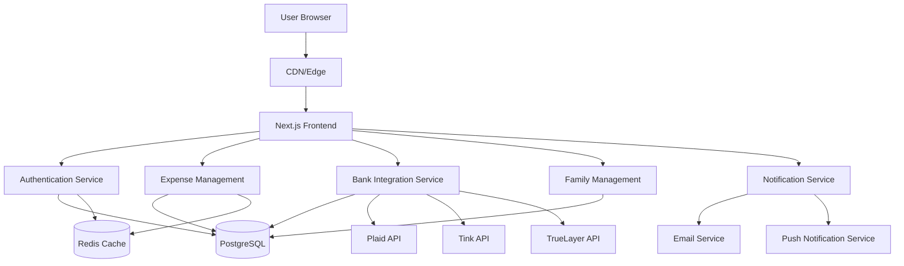
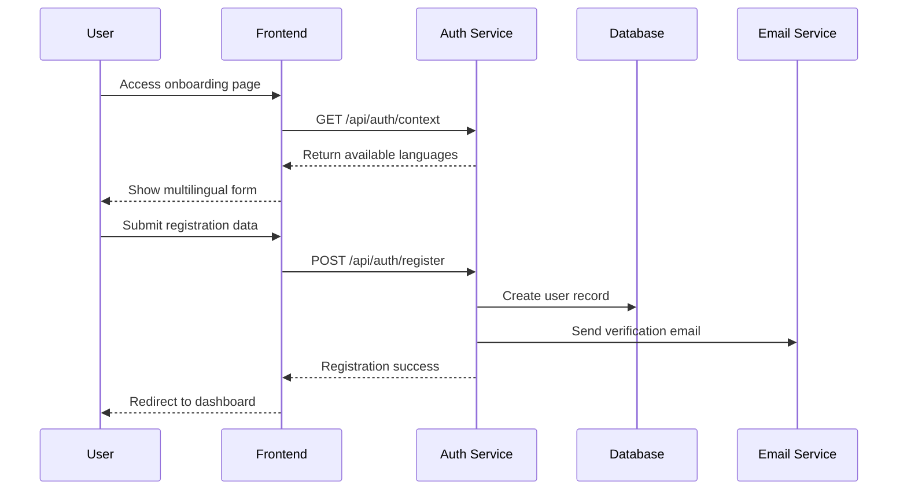
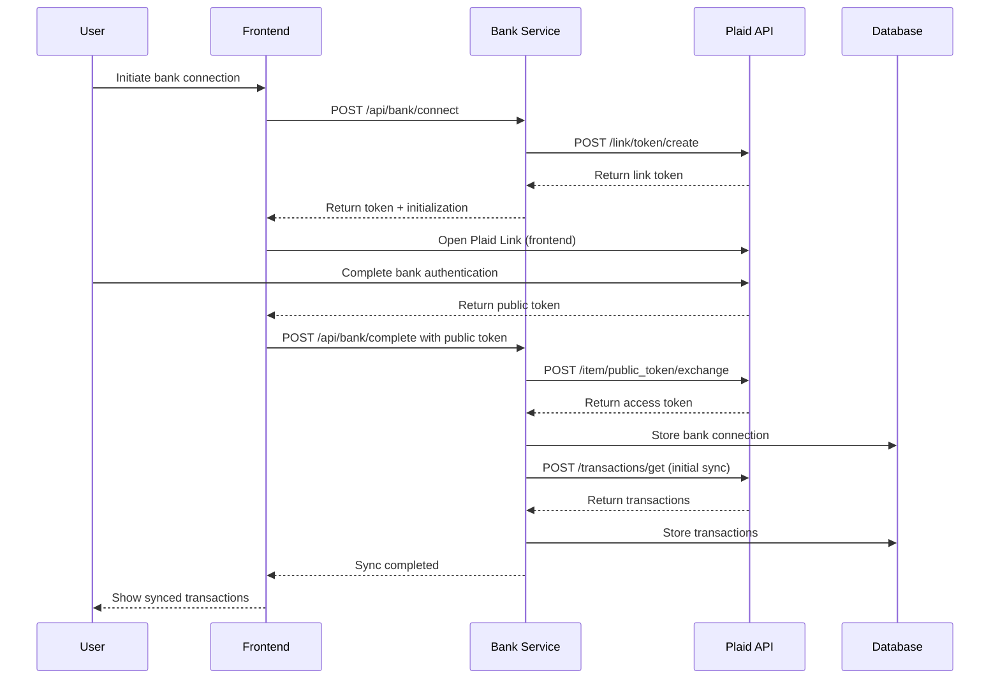

# Family Expense Tracker - System Architecture Document

## Introduction

This document outlines the overall project architecture for Family Expense Tracker, including backend systems, frontend components, and infrastructure. Its primary goal is to serve as the guiding architectural blueprint for AI-driven development, ensuring consistency and adherence to chosen patterns and technologies.

**Relationship to Frontend Architecture:** This project includes a significant user interface, so a separate Frontend Architecture Document will detail the frontend-specific design and MUST be used in conjunction with this document.

### Change Log

| Date       | Version | Description                   | Author          |
| ---------- | ------- | ----------------------------- | --------------- |
| 2024-01-15 | 1.0     | Initial architecture document | Architect Agent |

## High Level Architecture

### Technical Summary

The Family Expense Tracker is a full-stack web application built with a modern React/Next.js frontend and Node.js backend, using PostgreSQL as the primary database. The architecture follows a modular monolith pattern with clear separation between authentication, core expense management, bank integration, and family management services. The system is designed for global scalability with built-in multi-language support and responsive design across all components.

### High Level Overview

1. **Architectural Style**: Modular Monolith with API-first design
2. **Repository Structure**: Monorepo with clear package separation
3. **Service Architecture**: Single application with modular boundaries for future microservice extraction
4. **Primary User Flow**: User onboarding → Family group creation → Expense tracking → Financial insights
5. **Key Architectural Decisions**: 
   - Next.js for SSR and API routes
   - Prisma ORM for database management
   - JWT-based authentication with role-based access control
   - Hybrid bank integration through third-party providers
   - Real-time balance calculations

### High Level Project Diagram



### Architectural and Design Patterns

- **API-First Design**: RESTful APIs with OpenAPI specification for all backend services
- **Repository Pattern**: Abstract data access through repository interfaces
- **Strategy Pattern**: For bank integration providers (Plaid, Tink, TrueLayer)
- **Observer Pattern**: For real-time balance updates and notifications
- **Factory Pattern**: For multi-language content generation

## Tech Stack

### Cloud Infrastructure

- **Provider**: AWS (Amazon Web Services)
- **Key Services**: EC2, RDS, S3, CloudFront, Lambda, SNS, SES
- **Deployment Regions**: us-east-1 (Primary), eu-west-1 (Secondary)

### Technology Stack Table

| Category                 | Technology     | Version    | Purpose                   | Rationale                                                      |
| ------------------------ | -------------- | ---------- | ------------------------- | -------------------------------------------------------------- |
| **Frontend Framework**   | Next.js        | 14.0.0     | React framework with SSR  | Excellent i18n support, API routes, optimized performance      |
| **UI Library**           | React          | 18.2.0     | Component library         | Industry standard, extensive ecosystem                         |
| **Backend Runtime**      | Node.js        | 20.11.0    | Server-side JavaScript    | LTS version, async capabilities, team expertise                |
| **Backend Framework**    | NestJS         | 10.0.0     | API framework             | TypeScript support, modular architecture, dependency injection |
| **Database**             | PostgreSQL     | 15.0       | Primary data store        | ACID compliance, JSON support, financial data integrity        |
| **ORM**                  | Prisma         | 5.0.0      | Database client           | Type safety, migrations, excellent DX                          |
| **Caching**              | Redis          | 7.0.0      | Session storage & caching | High performance, pub/sub capabilities                         |
| **Authentication**       | JWT            | 9.0.0      | Token-based auth          | Stateless, scalable, industry standard                         |
| **Bank Integration**     | Plaid API      | 2020-09-14 | Bank data connectivity    | Global coverage, reliable API                                  |
| **Bank Integration**     | Tink API       | 2.0.0      | European bank integration | Strong EU presence, PSD2 compliant                             |
| **Bank Integration**     | TrueLayer      | 2.0.0      | UK bank integration       | Open banking specialist, UK coverage                           |
| **Internationalization** | next-i18next   | 13.0.0     | Multi-language support    | Next.js integration, SSR compatible                            |
| **Styling**              | Tailwind CSS   | 3.3.0      | Utility-first CSS         | Responsive design, rapid development                           |
| **Testing**              | Jest           | 29.0.0     | Testing framework         | Comprehensive testing, snapshot support                        |
| **E2E Testing**          | Playwright     | 1.38.0     | Browser testing           | Cross-browser, reliable automation                             |
| **Deployment**           | Docker         | 20.10.0    | Containerization          | Environment consistency, scaling                               |
| **CI/CD**                | GitHub Actions | -          | Automation                | GitHub integration, flexible workflows                         |

## Data Models

### User Model
**Purpose:** Store user account information and preferences

**Key Attributes:**
- `id`: UUID - Primary identifier
- `email`: String - Unique login identifier
- `password_hash`: String - Hashed password
- `name`: String - Display name
- `role`: Enum(Parent, Partner, Teen, Child) - System role
- `language`: Enum(EN, ZH-TW, ZH-CN, JA, ES) - Preference
- `currency`: String - Default currency code

**Relationships:**
- Belongs to a Family
- Has many Expenses
- Has many Contributions

### Family Model
**Purpose:** Represent family groups and their configuration

**Key Attributes:**
- `id`: UUID - Primary identifier
- `name`: String - Family display name
- `invite_code`: String - Unique invitation code
- `subscription_tier`: Enum(Free, Premium) - Payment status
- `default_currency`: String - Family currency setting

**Relationships:**
- Has many Users
- Has many Expenses
- Has many Goals

### Expense Model
**Purpose:** Track financial transactions within the family

**Key Attributes:**
- `id`: UUID - Primary identifier
- `amount`: Decimal - Transaction amount
- `currency`: String - Currency code
- `description`: String - Transaction description
- `category`: Enum(Food, Transportation, Entertainment, etc.) - Spending category
- `date`: DateTime - Transaction date
- `type`: Enum(Expense, Income, Transfer) - Transaction type
- `recurring`: Boolean - Is recurring expense
- `recurring_schedule`: JSON - Cron-like schedule definition

**Relationships:**
- Belongs to a User (payer)
- Belongs to a Family
- Optional connection to BankTransaction

### BankTransaction Model
**Purpose:** Store synced bank transactions

**Key Attributes:**
- `id`: UUID - Primary identifier
- `bank_id`: String - Provider's transaction ID
- `amount`: Decimal - Transaction amount
- `currency`: String - Currency code
- `description`: String - Original description
- `date`: DateTime - Transaction date
- `category`: String - Bank-provided category
- `merchant`: String - Merchant information
- `sync_status`: Enum(Pending, Matched, Ignored) - Reconciliation status

**Relationships:**
- Belongs to a User
- Optional connection to Expense

### Goal Model
**Purpose:** Track family savings goals

**Key Attributes:**
- `id`: UUID - Primary identifier
- `name`: String - Goal name
- `target_amount`: Decimal - Target amount
- `current_amount`: Decimal - Current savings
- `deadline`: DateTime - Target date
- `currency`: String - Currency code

**Relationships:**
- Belongs to a Family
- Has many Contributions

## Components

### Authentication Service
**Responsibility:** Handle user registration, login, and session management

**Key Interfaces:**
- `POST /api/auth/register` - User registration
- `POST /api/auth/login` - User login
- `POST /api/auth/logout` - User logout
- `POST /api/auth/refresh` - Token refresh

**Dependencies:** User Repository, JWT Service, Email Service

**Technology Stack:** NestJS, JWT, bcrypt, Redis

### Expense Management Service
**Responsibility:** Handle CRUD operations for expenses and balance calculations

**Key Interfaces:**
- `GET /api/expenses` - List expenses with filters
- `POST /api/expenses` - Create new expense
- `PUT /api/expenses/:id` - Update expense
- `DELETE /api/expenses/:id` - Delete expense
- `GET /api/balance` - Get current user balance

**Dependencies:** Expense Repository, User Repository, Notification Service

**Technology Stack:** NestJS, Prisma, Decimal.js

### Bank Integration Service
**Responsibility:** Handle connections to bank API providers and transaction syncing

**Key Interfaces:**
- `GET /api/bank/providers` - List available providers by region
- `POST /api/bank/connect` - Initiate bank connection
- `GET /api/bank/transactions` - Get synced transactions
- `POST /api/bank/transactions/match` - Match transaction to expense

**Dependencies:** Bank Provider Strategy, Transaction Repository

**Technology Stack:** Plaid SDK, Tink SDK, TrueLayer SDK, Strategy Pattern

### Family Management Service
**Responsibility:** Handle family group operations and member management

**Key Interfaces:**
- `POST /api/families` - Create family group
- `GET /api/families/:id` - Get family details
- `POST /api/families/:id/invite` - Generate invite
- `POST /api/families/join` - Join family with code
- `PUT /api/families/:id/members` - Update member roles

**Dependencies:** Family Repository, User Repository, Invite Service

**Technology Stack:** NestJS, Prisma, QR Code generation

## External APIs

### Plaid API
- **Purpose:** Bank account connectivity for North American banks
- **Documentation:** https://plaid.com/docs/
- **Base URL:** https://plaid.com
- **Authentication:** API keys + client secret
- **Rate Limits:** 100 requests/item/24hr (development)

**Key Endpoints Used:**
- `POST /link/token/create` - Create link token for frontend
- `POST /item/public_token/exchange` - Exchange public token for access token
- `POST /transactions/get` - Retrieve transactions

**Integration Notes:** Requires PCI compliance, data encryption at rest

### Tink API
- **Purpose:** European bank connectivity (PSD2 compliant)
- **Documentation:** https://docs.tink.com/
- **Base URL:** https://api.tink.com
- **Authentication:** OAuth 2.0 client credentials
- **Rate Limits:** Varies by agreement

**Key Endpoints Used:**
- `POST /api/v1/oauth/token` - Get access token
- `POST /api/v1/grants` - Create payment grant
- `GET /api/v1/transactions` - Retrieve transactions

**Integration Notes:** PSD2 compliance required, strong customer authentication

### TrueLayer API
- **Purpose:** UK open banking connectivity
- **Documentation:** https://docs.truelayer.com/
- **Base URL:** https://api.truelayer.com
- **Authentication:** OAuth 2.0 with PKCE
- **Rate Limits:** 1000 requests/minute

**Key Endpoints Used:**
- `POST /connect/token` - Get access token
- `GET /data/v1/transactions` - Retrieve transactions
- `GET /data/v1/accounts` - Get account information

**Integration Notes:** Open banking compliance, UK-focused coverage

## Core Workflows

### User Onboarding Sequence



### Bank Transaction Sync Sequence



## REST API Spec

```yaml
openapi: 3.0.0
info:
  title: Family Expense Tracker API
  version: 1.0.0
  description: API for family financial management application
servers:
  - url: https://api.expensetracker.com/v1
    description: Production server
  - url: http://localhost:3000/api
    description: Development server

components:
  securitySchemes:
    bearerAuth:
      type: http
      scheme: bearer
      bearerFormat: JWT

paths:
  /auth/login:
    post:
      summary: User login
      requestBody:
        required: true
        content:
          application/json:
            schema:
              type: object
              properties:
                email:
                  type: string
                  format: email
                password:
                  type: string
                  format: password
      responses:
        '200':
          description: Login successful
          content:
            application/json:
              schema:
                type: object
                properties:
                  token:
                    type: string
                  user:
                    $ref: '#/components/schemas/User'
  
  /expenses:
    get:
      summary: Get filtered expenses
      security:
        - bearerAuth: []
      parameters:
        - name: familyId
          in: query
          required: true
          schema:
            type: string
            format: uuid
        - name: page
          in: query
          schema:
            type: integer
            default: 1
      responses:
        '200':
          description: Expenses retrieved
          content:
            application/json:
              schema:
                type: object
                properties:
                  expenses:
                    type: array
                    items:
                      $ref: '#/components/schemas/Expense'
                  total:
                    type: integer
                  page:
                    type: integer

components:
  schemas:
    User:
      type: object
      properties:
        id:
          type: string
          format: uuid
        email:
          type: string
          format: email
        name:
          type: string
        role:
          type: string
          enum: [Parent, Partner, Teen, Child]
        language:
          type: string
          enum: [EN, ZH-TW, ZH-CN, JA, ES]
    
    Expense:
      type: object
      properties:
        id:
          type: string
          format: uuid
        amount:
          type: number
          format: decimal
        currency:
          type: string
        description:
          type: string
        category:
          type: string
        date:
          type: string
          format: date-time
        type:
          type: string
          enum: [Expense, Income, Transfer]
```

## Database Schema

```sql
-- Users table
CREATE TABLE users (
    id UUID PRIMARY KEY DEFAULT gen_random_uuid(),
    email VARCHAR(255) UNIQUE NOT NULL,
    password_hash VARCHAR(255) NOT NULL,
    name VARCHAR(255) NOT NULL,
    role VARCHAR(20) NOT NULL CHECK (role IN ('Parent', 'Partner', 'Teen', 'Child')),
    language VARCHAR(5) NOT NULL DEFAULT 'EN' CHECK (language IN ('EN', 'ZH-TW', 'ZH-CN', 'JA', 'ES')),
    currency VARCHAR(3) NOT NULL DEFAULT 'USD',
    family_id UUID REFERENCES families(id),
    created_at TIMESTAMP DEFAULT CURRENT_TIMESTAMP,
    updated_at TIMESTAMP DEFAULT CURRENT_TIMESTAMP
);

-- Families table
CREATE TABLE families (
    id UUID PRIMARY KEY DEFAULT gen_random_uuid(),
    name VARCHAR(255) NOT NULL,
    invite_code VARCHAR(12) UNIQUE NOT NULL,
    subscription_tier VARCHAR(20) DEFAULT 'Free' CHECK (subscription_tier IN ('Free', 'Premium')),
    default_currency VARCHAR(3) DEFAULT 'USD',
    created_at TIMESTAMP DEFAULT CURRENT_TIMESTAMP,
    updated_at TIMESTAMP DEFAULT CURRENT_TIMESTAMP
);

-- Expenses table
CREATE TABLE expenses (
    id UUID PRIMARY KEY DEFAULT gen_random_uuid(),
    amount DECIMAL(19,4) NOT NULL,
    currency VARCHAR(3) NOT NULL,
    description TEXT NOT NULL,
    category VARCHAR(50) NOT NULL,
    date TIMESTAMP NOT NULL,
    type VARCHAR(20) NOT NULL CHECK (type IN ('Expense', 'Income', 'Transfer')),
    recurring BOOLEAN DEFAULT FALSE,
    recurring_schedule JSONB,
    user_id UUID NOT NULL REFERENCES users(id),
    family_id UUID NOT NULL REFERENCES families(id),
    created_at TIMESTAMP DEFAULT CURRENT_TIMESTAMP,
    updated_at TIMESTAMP DEFAULT CURRENT_TIMESTAMP
);

-- Indexes for performance
CREATE INDEX idx_expenses_family_id ON expenses(family_id);
CREATE INDEX idx_expenses_user_id ON expenses(user_id);
CREATE INDEX idx_expenses_date ON expenses(date);
CREATE INDEX idx_users_family_id ON users(family_id);
```

## Source Tree

```
family-expense-tracker/
├── apps/
│   ├── web/                          # Next.js frontend application
│   │   ├── src/
│   │   │   ├── app/                  # App router pages
│   │   │   │   ├── (auth)/           # Authentication routes
│   │   │   │   ├── dashboard/        # Main app dashboard
│   │   │   │   ├── expenses/         # Expense management
│   │   │   │   ├── bank-sync/        # Bank integration
│   │   │   │   └── settings/         # User settings
│   │   │   ├── components/           # Reusable components
│   │   │   │   ├── ui/               # Basic UI components
│   │   │   │   ├── expenses/         # Expense-specific components
│   │   │   │   └── bank/             # Bank integration components
│   │   │   ├── lib/                  # Utility libraries
│   │   │   │   ├── i18n/             # Internationalization
│   │   │   │   ├── api/              # API client utilities
│   │   │   │   └── utils/            # General utilities
│   │   │   └── styles/               # Global styles
│   │   ├── public/                   # Static assets
│   │   │   └── locales/              # Translation files
│   │   └── package.json
│   └── api/                          # NestJS backend API
│       ├── src/
│       │   ├── auth/                 # Authentication module
│       │   ├── expenses/             # Expense management module
│       │   ├── bank/                 # Bank integration module
│       │   ├── families/             # Family management module
│       │   ├── shared/               # Shared utilities and types
│       │   └── main.ts               # Application entry point
│       └── package.json
├── packages/
│   ├── database/                     # Prisma database package
│   │   ├── prisma/
│   │   │   └── schema.prisma         # Database schema
│   │   └── package.json
│   ├── types/                        # Shared TypeScript types
│   │   └── package.json
│   └── config/                       # Shared configuration
│       └── package.json
├── infrastructure/                   # Infrastructure as Code
│   ├── terraform/                    # Terraform configurations
│   └── docker/                       # Docker configurations
├── scripts/                          # Utility scripts
└── package.json                      # Root package.json
```

## Infrastructure and Deployment

### Infrastructure as Code
- **Tool:** Terraform 1.5.0
- **Location:** `infrastructure/terraform/`
- **Approach:** Modular Terraform with environments (dev, staging, prod)

### Deployment Strategy
- **Strategy:** Blue-green deployment with gradual traffic shift
- **CI/CD Platform:** GitHub Actions
- **Pipeline Configuration:** `.github/workflows/deploy.yml`

### Environments
- **development:** Local development and testing - Auto-deploy on push to feature branches
- **staging:** Pre-production testing - Manual deployment approval required
- **production:** Live customer environment - Manual deployment with approval workflow

### Environment Promotion Flow
```
Feature Branch → CI Tests → Docker Build → Dev Deployment → 
Staging Deployment → Manual Testing → Production Deployment → Traffic Shift → Monitoring
```

### Rollback Strategy
- **Primary Method:** Automated rollback to previous deployment
- **Trigger Conditions:** Error rate > 5%, latency > 2000ms, health check failures
- **Recovery Time Objective:** < 5 minutes

## Error Handling Strategy

### General Approach
- **Error Model:** Structured error responses with HTTP status codes
- **Exception Hierarchy:** Custom application exceptions with proper inheritance
- **Error Propagation:** Centralized error handling middleware

### Logging Standards
- **Library:** Winston 3.10.0 with structured logging
- **Format:** JSON format with timestamp, service context, correlation ID
- **Levels:** debug, info, warn, error, critical
- **Required Context:**
  - Correlation ID: UUIDv4 format for request tracing
  - Service Context: Service name, version, environment
  - User Context: User ID, family ID (when authenticated)

### Error Handling Patterns

#### External API Errors
- **Retry Policy:** Exponential backoff with jitter (max 3 retries)
- **Circuit Breaker:** 50% failure rate triggers circuit break for 30 seconds
- **Timeout Configuration:** 10s timeout for external API calls
- **Error Translation:** Map provider errors to standardized error codes

#### Business Logic Errors
- **Custom Exceptions:** Domain-specific exceptions (e.g., InsufficientBalanceException)
- **User-Facing Errors:** Localized error messages with user-friendly explanations
- **Error Codes:** Standardized error code system for client handling

#### Data Consistency
- **Transaction Strategy:** Database transactions for financial operations
- **Compensation Logic:** Saga pattern for distributed transactions
- **Idempotency:** Idempotency keys for financial transactions

## Coding Standards

### Core Standards
- **Languages & Runtimes:** TypeScript 5.0, Node.js 20.11.0
- **Style & Linting:** ESLint with Prettier, strict TypeScript rules
- **Test Organization:** Tests alongside source code with `.test.ts` suffix

### Critical Rules
- **Never use console.log in production code** - Use structured logger with appropriate levels
- **All API responses must follow standardized response format** - { data: {}, error: null } or { data: null, error: {} }
- **Database queries must use Prisma client** - Never raw SQL unless absolutely necessary
- **All user-facing text must be wrapped in i18n function** - No hardcoded strings
- **Financial calculations must use Decimal.js** - Never native JavaScript numbers
- **Environment variables must be validated at application startup** - Using Zod validation

## Test Strategy and Standards

### Testing Philosophy
- **Approach:** Test-driven development with emphasis on integration tests
- **Coverage Goals:** 80% unit test coverage, 70% integration test coverage
- **Test Pyramid:** 60% unit tests, 30% integration tests, 10% E2E tests

### Test Types and Organization

#### Unit Tests
- **Framework:** Jest 29.0.0 with TypeScript support
- **File Convention:** `*.test.ts` alongside source files
- **Location:** Same directory as source files
- **Mocking Library:** Jest built-in mocking with ts-jest
- **Coverage Requirement:** 80% minimum

**AI Agent Requirements:**
- Generate tests for all public methods and components
- Cover edge cases and error conditions for financial operations
- Follow AAA pattern (Arrange, Act, Assert)
- Mock all external dependencies (databases, APIs, services)

#### Integration Tests
- **Scope:** API endpoints, database interactions, service integrations
- **Location:** `__tests__/integration/` directory
- **Test Infrastructure:**
  - **Database:** Testcontainers PostgreSQL for isolated testing
  - **API:** Supertest for HTTP endpoint testing
  - **Redis:** Mock Redis server for testing

#### End-to-End Tests
- **Framework:** Playwright 1.38.0
- **Scope:** Critical user journeys across authentication, expense tracking, bank sync
- **Environment:** Dedicated testing environment with test data
- **Test Data:** Factory-created test data with cleanup after tests

### Test Data Management
- **Strategy:** Factory pattern with test data builders
- **Fixtures:** `tests/fixtures/` directory with sample data
- **Factories:** Test data factories for each model
- **Cleanup:** Database truncation after each test suite

### Continuous Testing
- **CI Integration:** GitHub Actions with test matrix (unit, integration, E2E)
- **Performance Tests:** Lighthouse CI for frontend performance
- **Security Tests:** OWASP ZAP integration for security scanning

## Security

### Input Validation
- **Validation Library:** Zod with strict schema validation
- **Validation Location:** API boundary before processing
- **Required Rules:**
  - All external inputs MUST be validated against Zod schemas
  - Validation at API boundary before any processing
  - Whitelist approach for all input validation

### Authentication & Authorization
- **Auth Method:** JWT tokens with RS256 algorithm
- **Session Management:** Stateless JWT with refresh token rotation
- **Required Patterns:**
  - Role-based access control for all endpoints
  - Resource-level authorization checks
  - Password hashing with bcrypt (cost factor 12)

### Secrets Management
- **Development:** Dotenv with .env files (excluded from git)
- **Production:** AWS Secrets Manager with IAM access control
- **Code Requirements:**
  - NEVER hardcode secrets in source code
  - Access secrets via configuration service only
  - No secrets in logs or error messages

### API Security
- **Rate Limiting:** Redis-based rate limiting (100 requests/minute per user)
- **CORS Policy:** Strict CORS with allowed origins configuration
- **Security Headers:** Helmet.js with strict Content Security Policy
- **HTTPS Enforcement:** HTTP to HTTPS redirect in production

### Data Protection
- **Encryption at Rest:** AWS RLS encryption with AWS KMS
- **Encryption in Transit:** TLS 1.3 for all communications
- **PII Handling:** Pseudonymization of sensitive user data
- **Logging Restrictions:** No PII in logs, masked data where necessary

### Dependency Security
- **Scanning Tool:** Snyk integration with GitHub Actions
- **Update Policy:** Weekly dependency updates with automated PRs
- **Approval Process:** Security team review for new dependencies

### Security Testing
- **SAST Tool:** Semgrep with custom rules for financial applications
- **DAST Tool:** OWASP ZAP automated scanning
- **Penetration Testing:** Quarterly third-party penetration tests

## Checklist Results Report

*Checklist validation will be executed after architecture document completion*

## Next Steps

1. **Frontend Architecture Creation**: Use "Frontend Architecture Mode" with this document as input to create detailed frontend architecture
2. **Product Owner Review**: Review this architecture with Product Owner for alignment with PRD requirements
3. **Story Implementation**: Begin story implementation with Dev agent starting with Epic 0 (Account Creation & Onboarding)
4. **Infrastructure Setup**: Set up AWS infrastructure with DevOps agent using Terraform configurations

### Architect Prompt for Frontend Architecture

Create a comprehensive Frontend Architecture Document for the Family Expense Tracker based on the main architecture defined here. Focus on:

- Next.js 14 application structure with App Router
- Component architecture following atomic design principles
- State management strategy for financial data
- Internationalization implementation with next-i18next
- Responsive design system with Tailwind CSS
- Bank integration component design for Plaid Link
- Real-time balance display components
- Testing strategy for UI components

Ensure alignment with the backend architecture patterns and technology choices specified in this document, particularly for API integration, authentication flow, and error handling.

---

This architecture document provides the foundation for implementing the Family Expense Tracker according to PRD v0.94.0 requirements. The modular monolith approach allows for focused development while maintaining the flexibility to extract services as the application scales.