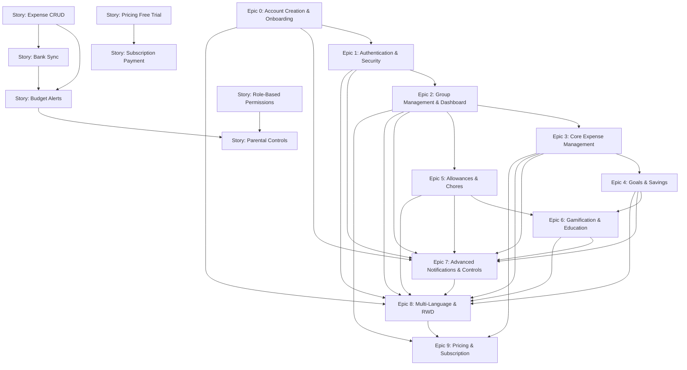

# System Architecture & Dependency Flow — v0.94.3

> Derived from PRD v0.93.0 (Epics 0–9) and updated dependency chart
> 

---

## 1. Overview

This update (v0.94.3) aligns the **system dependency flow chart** with the latest PRD (v0.93.0), which includes **Epics 0–9**. It shows sequencing of Epics and Story-level dependencies, ensuring that foundational onboarding, authentication, and group management precede higher-value features.

---

## 2. Epic & Story Dependency Flow

---

## 3. Key Highlights

- **Foundational Layer:** Epics 0–2 must be implemented first (Onboarding, Auth, Dashboard).
- **Core Expense Management (Epic 3)** unlocks **Goals, Allowances, and Pricing integration**.
- **Gamification (Epic 6)** depends on both **Goals (Epic 4)** and **Allowances (Epic 5)**.
- **Notifications & Controls (Epic 7)** span across all Epics, enforcing security.
- **Multi-Language & RWD (Epic 8)** underpins every Epic, ensuring consistent global usability.
- **Pricing & Subscription (Epic 9)** relies on Dashboard, Expense features, and i18n foundation.
- **Story Dependencies:** CRUD precedes Alerts & Sync; Role-Based Permissions precede Parental Controls; Pricing Free Trial precedes Subscription Payment.

---

## 4. Next Steps

1. Use this dependency map to finalize sprint sequencing (MVP → Value-add → Engagement → Monetization).
2. Sync backlog with Jira to enforce dependencies.
3. Validate UX flows (v0.94.0) against dependency structure.

---

*Prepared by: Architect — Winston*

✅ Updated — **System Architecture v0.94.3** now reflects the **latest PRD v0.93.0 (Epics 0–9)** with a full Epic & Story dependency flow chart.

Would you like me to also **translate this dependency map into a sprint-by-sprint implementation plan** (Sprint 1 → Sprint N) for delivery sequencing?