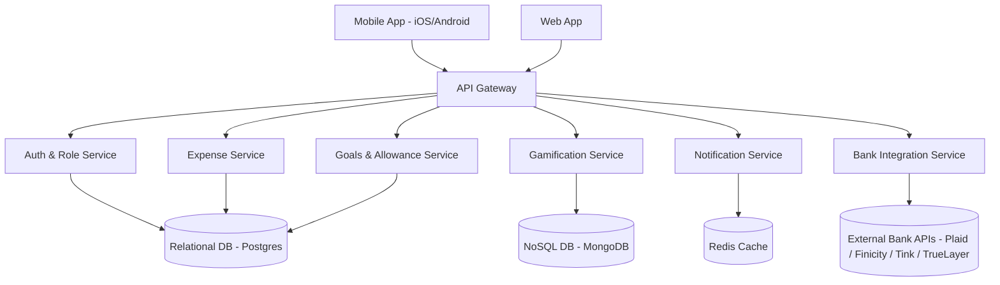
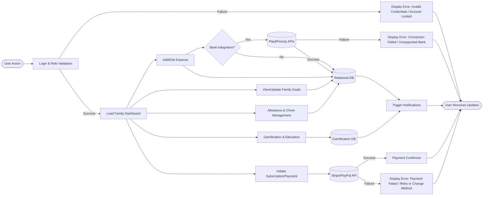

# System Architecture & Processing Flow — v0.94.2

> Derived from v0.94.1, expanded with error handling flows
> 

---

## 1. Overview

This update (v0.94.2) extends the **system processing flow chart** with **error handling paths** for critical user journeys: login, bank sync, and payments. These flows ensure users receive localized, meaningful error states while maintaining system resilience.

---

## 2. Block Diagram (unchanged from v0.94.1)

---

## 3. Processing Flow Chart with Error Handling

---

## 4. Key Highlights

- **Auth Errors:** Localized messages (invalid login, locked account, verification required).
- **Bank Sync Errors:** Fallback to manual entry if provider fails or unsupported.
- **Payment Errors:** Retry flow with multiple payment methods, clear error transparency.
- **Notifications:** Error states also generate push/email alerts where relevant.

---

## 5. Next Steps

1. Integrate **localized error dictionaries** (EN, ZH-TW, ZH-CN, JA, ES).
2. Add retry and fallback mechanisms to UX flows.
3. Conduct usability testing on error states to ensure clarity and trust.

---

*Prepared by: Architect — Winston*