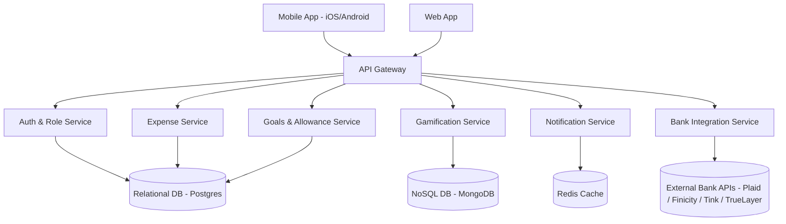

# System Architecture — v0.94.1

> Derived from v0.94.0 architecture plan and updated block diagram request
> 

---

## 1. Overview

This update (v0.94.1) introduces a **refined block diagram** for the Family Expense Tracker system architecture, aligning frontend clients, backend services, and storage layers into a clear component view. It builds upon v0.94.0, with explicit mapping of services to data stores and third-party integrations.

---

## 2. Block Diagram

---

## 3. Component Mapping

- **Clients:**
    - Mobile App (iOS/Android, React Native).
    - Web App (Next.js/React).
- **API Gateway:** Central entry point, routing to microservices with GraphQL aggregation and REST passthrough.
- **Services:**
    - **Auth & Role Service:** Authentication, JWT, RBAC, social logins.
    - **Expense Service:** CRUD, recurring rules, categorization.
    - **Goals & Allowance Service:** Goals, savings tracking, chores, allowances.
    - **Gamification Service:** Achievements, badges, leaderboards.
    - **Notification Service:** Push notifications, email/SMS alerts, parental controls.
    - **Bank Integration Service:** Pluggable adapters for global providers (Plaid, Finicity, Tink, TrueLayer, SaltEdge).
- **Data Stores:**
    - **Postgres (RDS):** Core relational data (Users, Families, Expenses, Goals, Allowances).
    - **MongoDB:** Event-driven gamification, progress tracking, non-relational structures.
    - **Redis:** Caching, real-time notifications, ephemeral session data.
    - **External Bank APIs:** Secure integrations for financial data sync.

---

## 4. Key Updates from v0.94.0

- Formalized **separation of storage responsibilities**:
    - Postgres for relational.
    - MongoDB for gamification.
    - Redis for notifications & caching.
- **Bank Integration Service** explicitly tied to multiple provider APIs.
- Clearer client-to-gateway mapping (mobile + web).

---

## 5. Next Steps

1. Expand deployment diagram with Kubernetes clusters and data residency plan.
2. Define internal service-to-service communication contracts (gRPC or REST).
3. Align UX deliverables (v0.94.0) with service API entry points.
4. Prepare scaling plan for real-time workloads (notifications, gamification).