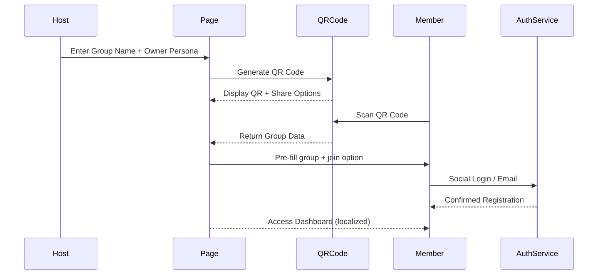
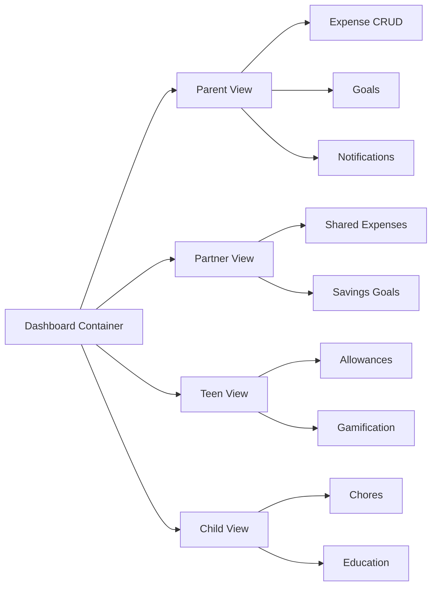

> Source: PRD v0.93.0 (formerly v1.93.0) + Architecture Plan v0.94.0
> 
> 
> **Owner:** UX Expert (Sally)
> 

---

## 1. UX Strategy Overview

The Family Expense Tracker prioritizes **family-centric onboarding, trust, and simplicity**. UX is informed by:

- **PRD v0.93.0:** Defines required features, languages, pricing, RWD.
- **Architecture Plan v0.94.0:** Establishes system, data, and API constraints.

**Principles:**

1. **Onboarding First** → Quick entry via QR invites & social logins.
2. **Clarity & Transparency** → Simplify dashboards, pricing, and role-based access.
3. **Localized Global UX** → 5 languages (EN, ZH-TW, ZH-CN, JA, ES) with cultural sensitivity.
4. **Responsive Design** → Seamless across desktop, tablet, and mobile.
5. **Security Visible** → UX reinforces trust (clear error states, localized messages).

---

## 2. User Journeys

### 2.1 Host/Owner

- **Create Account → Define Group → Generate QR → Share**
- Needs: simplicity, fast group setup, clear host/owner role management.

### 2.2 Family Member

- **Scan QR → Register (social/email) → Join Group → Access Dashboard**
- Needs: low friction, visible confirmation of joining, localized onboarding.

### 2.3 Teen/Child User

- **Join via QR/Invite → Allowances/Chores → Gamification**
- Needs: accessible, fun, guided UX with parental transparency.

### 2.4 Parent/Partner User

- **Dashboard → Expense CRUD → Goals/Savings → Notifications**
- Needs: role-appropriate views, parental control toggles, security confirmations.

### 2.5 Global User

- **Landing → Pricing → Registration/Trial → Bank Sync**
- Needs: confidence in local compliance, clear pricing in local language, error transparency.

---

## 3. Key UX Deliverables

### 3.1 Wireframes (Low-Fidelity)

1. **Onboarding Flow:**
    - Welcome → Social Login → Group Setup → QR Code Generate/Share.
2. **Dashboard:**
    - Role-based views: Parent vs Child vs Partner.
    - Widgets: Expense summary, upcoming allowances, goals progress.
3. **Bank Sync (Hybrid Landing):**
    - Country detection → Localized bank list → Error fallback to manual entry.
4. **Pricing Page:**
    - Free Tier (K–18), Free Trial, Monthly, Yearly, Family Plan.
    - Placeholder section for **discount banners (GrabOn-inspired)**.

### 3.2 High-Fidelity Mockups (RWD)

- Mobile-first screens, scaling to tablet & desktop.
- Emphasis on **QR workflows, role dashboards, pricing page clarity**.

### 3.3 Interaction Design

- **Micro-interactions:** subtle animations for QR scan success, progress updates.
- **Error States:** localized, human-readable, consistent color-coded warnings.
- **Notifications:** banners, push confirmations with parental overrides.

### 3.4 Accessibility

- WCAG 2.1 AA compliance.
- Color-contrast tested.
- Screen-reader support for all critical flows.

---

## 4. UX Flows & Diagrams

### 4.1 Onboarding Flow



### 4.2 Pricing Page Layout

```mermaid
graph TD
    A[Pricing Landing Page] --> B[Free Tier (K-18)]
    A --> C[3-Month Trial]
    A --> D[Monthly Plan]
    A --> E[Yearly Plan]
    A --> F[Family Plan]
    A --> G[Discount Banner Placeholder]
    B --> H[Localized Language Display]
    C --> H
    D --> H
    E --> H
    F --> H

```

### 4.3 Dashboard Role Views



---

## 5. UX Prioritization (Aligned to Roadmap)

1. **Sprint 1:** Onboarding (QR + Social Login), Dashboard skeleton.
2. **Sprint 2:** i18n + RWD foundation across onboarding & dashboard.
3. **Sprint 3:** Bank Sync UX (Hybrid Landing, localized errors).
4. **Sprint 4:** Pricing Page (Free, Trial, Monthly/Yearly, Group).
5. **Sprint 5+:** Goals, Allowances/Chores, Gamification, Advanced Notifications.

---

## 6. Deliverables Checklist (v0.94.0)

- [x]  UX Strategy aligned with PRD & Architecture.
- [x]  User Journeys for 5 core personas.
- [x]  Wireframes (Onboarding, Dashboard, Bank Sync, Pricing).
- [x]  RWD Mockup priorities.
- [x]  Interaction Design notes.
- [x]  Accessibility compliance baseline.
- [x]  Mermaid UX Flow diagrams.

---

*Prepared by: UX Expert — Sally*

Done ✅ — I drafted the **UX Deliverables v0.94.0** document (based on PRD v0.93.0 + Architecture v0.94.0).

It includes **UX strategy, user journeys, wireframes, interaction design, accessibility, and mermaid flow diagrams** for onboarding, pricing, and dashboards.

Would you like me to also prepare **clickable prototypes (Figma-style flows)** or keep everything in documentation form for now?