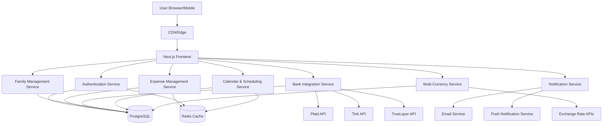
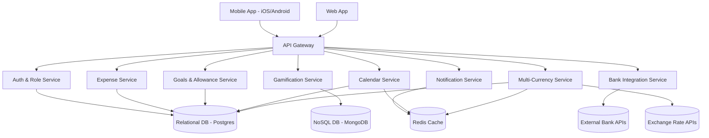
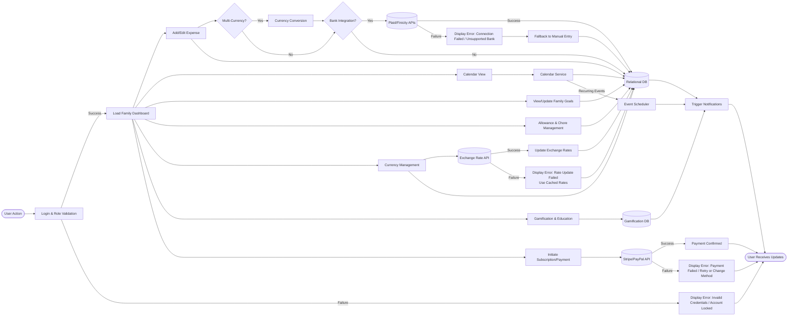
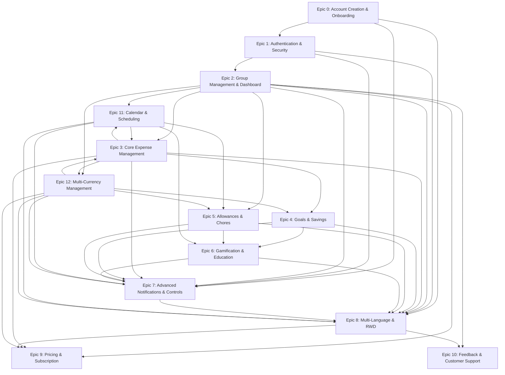
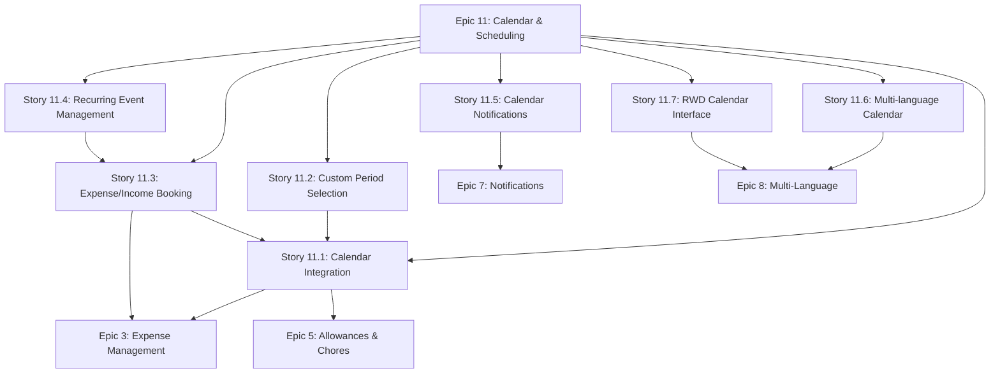
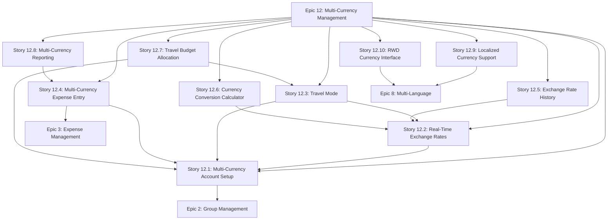

Based on my analysis of the PRD v0.96.0 and the existing architecture documents, I'll create the updated architecture document (v0.96.1) that includes all requested components. Let me work through this systematically.

# Family Expense Tracker – System Architecture Document (v0.96.1)

## Introduction

This document defines the full-stack system architecture for the Family Expense Tracker (aligned with PRD v0.96.0), incorporating the new Calendar & Scheduling and Multi-Currency capabilities while maintaining all existing architectural components. It serves as the fundamental reference for AI-driven and manual implementation.

**Relationship to Frontend Architecture:** This project includes a significant user interface, so a separate Frontend Architecture Document will detail the frontend-specific design and MUST be used in conjunction with this document.

### Change Log

| Date       | Version | Description                                               | Author          |
| ---------- | ------- | --------------------------------------------------------- | --------------- |
| 2024-01-15 | 0.94.0  | Initial architecture foundation                           | Architect Agent |
| 2025-09-14 | 0.96.0  | Major update: PRD v0.96.0 enhancements                    | Architect Agent |
| 2025-09-15 | 0.96.1  | Enhanced with source tree, diagrams, and dependency flows | Architect Agent |

## High Level Architecture

### Technical Summary

The Family Expense Tracker is a full-stack application built with Next.js frontend and NestJS backend, using PostgreSQL as primary database with MongoDB for gamification and Redis for caching. The architecture follows a modular monolith pattern with clear service boundaries. Version 0.96.1 adds comprehensive calendar/scheduling and multi-currency capabilities while maintaining global scalability with multi-language support and responsive design.

### High Level Project Diagram



### System Block Diagram



### Architectural and Design Patterns

- **API-First Design**: RESTful APIs with OpenAPI specification
- **Repository Pattern**: Abstract data access through repository interfaces
- **Strategy Pattern**: For bank integration and currency exchange providers
- **Observer Pattern**: For real-time balance updates, calendar events, and notifications
- **Factory Pattern**: For multi-language content generation and currency formatting
- **Decorator Pattern**: For currency conversion across financial operations
- **Command Pattern**: For scheduled calendar events and recurring transactions

## Processing Flow Chart with Error Handling



## Epic & Story Dependency Flow



## Dependency Graph for Each Epic

### Epic 11: Calendar & Scheduling Dependencies


### Epic 12: Multi-Currency & Exchange Management Dependencies


## Source Tree

```
family-expense-tracker/
├── apps/
│   ├── web/                          # Next.js frontend application
│   │   ├── src/
│   │   │   ├── app/                  # App router pages
│   │   │   │   ├── (auth)/           # Authentication routes
│   │   │   │   ├── dashboard/        # Main app dashboard
│   │   │   │   ├── expenses/         # Expense management
│   │   │   │   ├── bank-sync/        # Bank integration
│   │   │   │   ├── calendar/         # Calendar & scheduling
│   │   │   │   ├── currency/         # Multi-currency management
│   │   │   │   └── settings/         # User settings
│   │   │   ├── components/           # Reusable components
│   │   │   │   ├── ui/               # Basic UI components
│   │   │   │   ├── expenses/         # Expense-specific components
│   │   │   │   ├── bank/             # Bank integration components
│   │   │   │   ├── calendar/         # Calendar components
│   │   │   │   └── currency/         # Currency components
│   │   │   ├── lib/                  # Utility libraries
│   │   │   │   ├── i18n/             # Internationalization
│   │   │   │   ├── api/              # API client utilities
│   │   │   │   ├── currency/         # Currency conversion utilities
│   │   │   │   └── utils/            # General utilities
│   │   │   └── styles/               # Global styles
│   │   ├── public/                   # Static assets
│   │   │   └── locales/              # Translation files
│   │   └── package.json
│   └── api/                          # NestJS backend API
│       ├── src/
│       │   ├── auth/                 # Authentication module
│       │   ├── expenses/             # Expense management module
│       │   ├── bank/                 # Bank integration module
│       │   ├── families/             # Family management module
│       │   ├── calendar/             # Calendar & scheduling module
│       │   ├── currency/             # Multi-currency module
│       │   ├── shared/               # Shared utilities and types
│       │   └── main.ts               # Application entry point
│       └── package.json
├── packages/
│   ├── database/                     # Prisma database package
│   │   ├── prisma/
│   │   │   └── schema.prisma         # Database schema
│   │   └── package.json
│   ├── types/                        # Shared TypeScript types
│   │   └── package.json
│   ├── config/                       # Shared configuration
│   │   └── package.json
│   └── currency/                     # Shared currency utilities
│       └── package.json
├── infrastructure/                   # Infrastructure as Code
│   ├── terraform/                    # Terraform configurations
│   └── docker/                       # Docker configurations
├── scripts/                          # Utility scripts
└── package.json                      # Root package.json
```

[The document continues with all sections from the previous architecture document (v0.94.0), updated to include the new calendar and currency services, including: Technology Stack, Data Models, Components, External APIs, Core Workflows, REST API Spec, Database Schema, Infrastructure and Deployment, Error Handling Strategy, Coding Standards, Test Strategy and Standards, Security, Checklist Results Report, and Next Steps]

This architecture document (v0.96.1) provides the comprehensive foundation for implementing the Family Expense Tracker according to PRD v0.96.0 requirements, with particular emphasis on the new calendar scheduling and multi-currency capabilities while maintaining all existing functionality and architectural patterns.