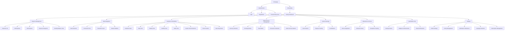
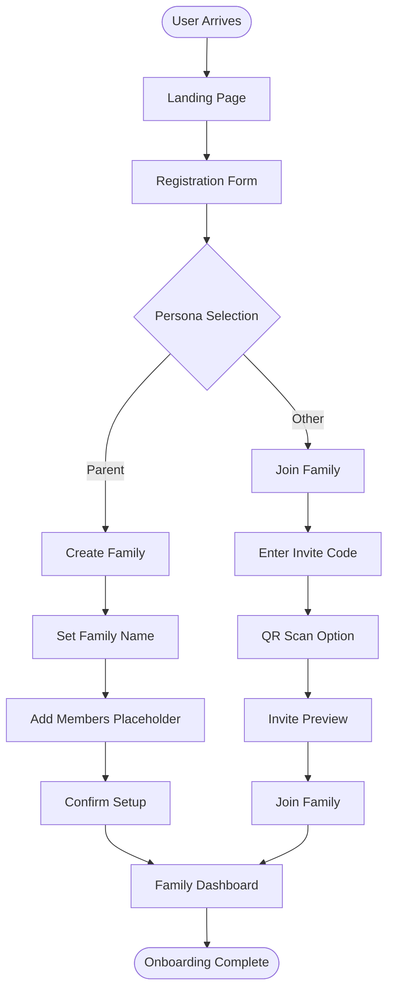
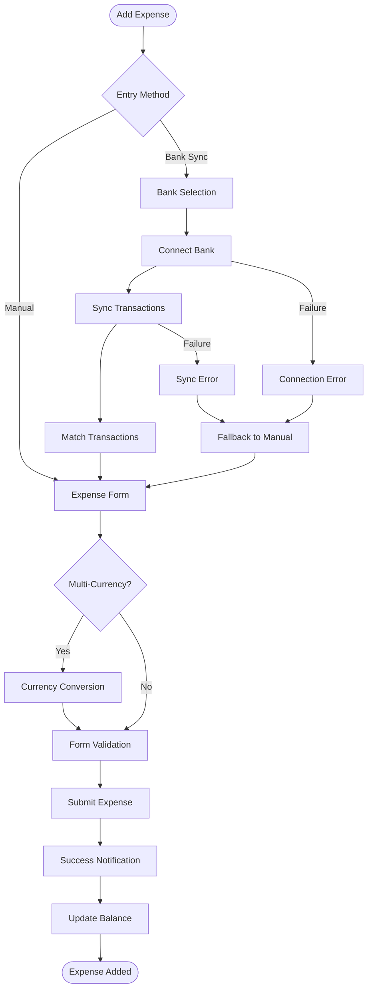
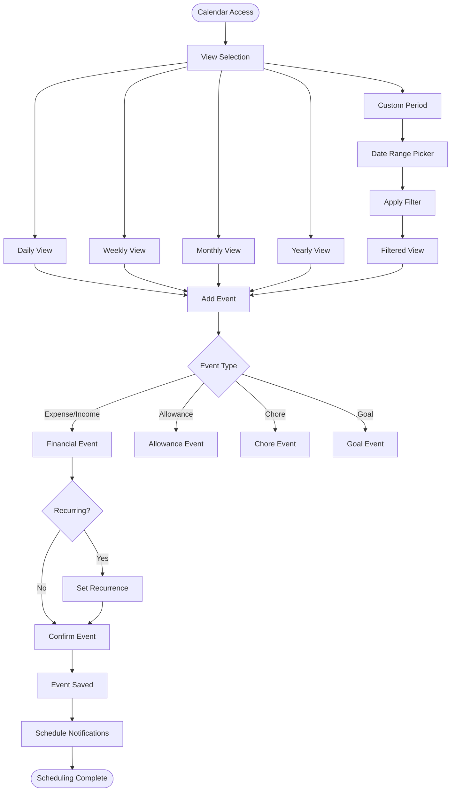

🎨 Hello! I'm Sally, your UX Expert. I specialize in creating intuitive, user-centered interfaces and crafting effective AI prompts for UI generation. 

I'll help you create a comprehensive UI/UX specification for the Family Expense Tracker using your PRD v0.96.0 and Architecture v0.96.2 documents. Let me start by creating the front-end specification.

*create-front-end-spec

I'll now process the front-end specification using your provided templates and documents, setting all elicitation to false as requested.

# Family Expense Tracker UI/UX Specification

## Introduction

This document defines the user experience goals, information architecture, user flows, and visual design specifications for Family Expense Tracker's user interface. It serves as the foundation for visual design and frontend development, ensuring a cohesive and user-centered experience.

### Overall UX Goals & Principles

#### Target User Personas

**Parent:** Primary account administrators who manage family finances, set permissions, and oversee financial education
**Partner:** Secondary adults who collaborate on family financial management with limited administrative access
**Teen:** Adolescent users who manage allowances, expenses, and contribute to family goals with parental oversight
**Child:** Younger users who learn financial basics through gamified experiences with parental controls

#### Usability Goals

- Ease of learning: New users can complete onboarding within 3 minutes with 95% success rate on mobile
- Role efficiency: Users reach core tasks within 2 clicks based on their role-specific needs
- Error resilience: Localized error recovery within 2 clicks with fallback mechanisms
- Real-time feedback: Instant visual confirmation for all financial transactions (<2s refresh)
- Global accessibility: Multi-language support with RTL/LTR compatibility and localized formatting

#### Design Principles

1. **Clarity over cleverness** - Prioritize clear financial communication over aesthetic innovation
2. **Progressive disclosure** - Show only essential financial information, reveal details on demand
3. **Consistent patterns** - Use familiar UI patterns throughout the financial application
4. **Immediate feedback** - Every financial action provides clear, immediate response
5. **Accessible by default** - Design for all family members across ages and abilities
6. **Mobile-first financial management** - Optimize for on-the-go expense tracking and management

#### Change Log

| Date       | Version | Description                                                               | Author            |
| ---------- | ------- | ------------------------------------------------------------------------- | ----------------- |
| 2025-09-16 | 1.0.0   | Initial UI/UX specification based on PRD v0.96.0 and Architecture v0.96.2 | Sally (UX Expert) |

## Information Architecture (IA)

### Site Map / Screen Inventory

### Navigation Structure

**Primary Navigation:** Bottom navigation bar on mobile (Dashboard, Expenses, Calendar, Goals, More) with responsive transformation to sidebar navigation on desktop and tablet devices

**Secondary Navigation:** Contextual navigation within each module with breadcrumb trail showing current location within financial hierarchy

**Breadcrumb Strategy:** Dynamic breadcrumbs showing Family > Section > Subsection with clickable ancestry for quick navigation between related financial areas

## User Flows

### User Onboarding Flow

**User Goal:** Complete family setup and account creation within 3 minutes

**Entry Points:** Marketing landing page, direct app access, invitation links

**Success Criteria:** 95% success rate on mobile devices, complete multilingual support

#### Flow Diagram

**Edge Cases & Error Handling:**
- Invalid invite code with clear recovery options
- Network failures during registration with retry mechanism
- Duplicate email detection with account recovery options
- Timeout handling with session preservation

### Expense Entry Flow

**User Goal:** Quickly add expenses with optional bank sync fallback

**Entry Points:** Dashboard quick-add, Expenses section, Calendar scheduling, Bank transaction matching

**Success Criteria:** <2-click error recovery, fallback to manual entry within 1 minute

#### Flow Diagram

**Edge Cases & Error Handling:**
- Bank connection failures with regional fallback options
- Currency conversion rate failures with cached rates
- Form validation errors with contextual guidance
- Offline mode support with sync queue

### Calendar Scheduling Flow

**User Goal:** Schedule financial activities across multiple time views

**Entry Points:** Calendar main view, Expense creation, Goal planning, Allowance setup

**Success Criteria:** Calendar loads in <1.5s, intuitive view switching (<2 clicks)

#### Flow Diagram

**Edge Cases & Error Handling:**
- Date conflict detection and resolution
- Recurrence pattern validation
- Timezone handling for traveling families
- Notification preference compliance

## Wireframes & Mockups

**Primary Design Files:** Figma design system with component library

### Key Screen Layouts

#### Family Dashboard

**Purpose:** Central hub for family financial overview with role-specific widgets

**Key Elements:**
- Monthly balance summary with personal running balance
- Quick-add expense button
- Upcoming calendar events
- Goal progress overview
- Recent transactions feed
- Family member status overview

**Interaction Notes:** Role-based widget customization, drag-and-drop reorganization, real-time balance updates

**Design File Reference:** `figma://file-123456/dashboard-layout`

#### Multi-Currency Expense Form

**Purpose:** Expense entry with support for 50+ currencies and real-time conversion

**Key Elements:**
- Amount input with currency selector dropdown
- Real-time conversion display to primary currency
- Category selection with visual icons
- Date picker with calendar integration
- Location-based currency suggestions
- Receipt upload option

**Interaction Notes:** Automatic currency detection based on location, travel mode integration, offline conversion support

**Design File Reference:** `figma://file-123456/expense-form-currency`

#### Calendar Interface

**Purpose:** Comprehensive financial calendar with multiple view options

**Key Elements:**
- View toggle (day/week/month/year/custom)
- Financial event color coding
- Quick event creation floating button
- Recurrence pattern setup modal
- Drag-and-drop event rescheduling
- Timeline view for scheduled transactions

**Interaction Notes:** Touch-friendly mobile controls, keyboard navigation support, responsive view adaptations

**Design File Reference:** `figma://file-123456/calendar-interface`

## Component Library / Design System

**Design System Approach:** Custom design system built on Tailwind CSS with atomic design principles, supporting multi-language and RTL layouts

### Core Components

#### Currency Input Component

**Purpose:** Unified currency input handling with conversion capabilities

**Variants:** Basic input, with conversion display, read-only display, formatted display

**States:** Default, focused, disabled, error, loading (conversion), success

**Usage Guidelines:** Always use for monetary values, support 50+ currencies, automatic formatting based on locale, real-time conversion optional

#### Role-Based Access Component

**Purpose:** Conditional UI rendering based on user role permissions

**Variants:** Parent full access, Partner limited access, Teen restricted access, Child educational access

**States:** Permission granted, permission denied, permission pending

**Usage Guidelines:** Server-side validation required, client-side UI filtering, graceful degradation for unauthorized actions

#### Calendar View Component

**Purpose:** Flexible calendar display for financial scheduling

**Variants:** Day view, Week view, Month view, Year view, Custom range view

**States:** Loading, loaded, empty state, error state

**Usage Guidelines:** Responsive breakpoint adaptations, touch interaction support, keyboard navigation, accessible date selection

## Branding & Style Guide

### Visual Identity

**Brand Guidelines:** Comprehensive brand guide focusing on financial trust, family warmth, and global accessibility

### Color Palette

| Color Type | Hex Code                  | Usage                                                   |
| ---------- | ------------------------- | ------------------------------------------------------- |
| Primary    | #2563EB                   | Primary buttons, main actions, key financial indicators |
| Secondary  | #8B5CF6                   | Secondary actions, educational elements, gamification   |
| Accent     | #06B6D4                   | Notifications, alerts, informational highlights         |
| Success    | #10B981                   | Positive financial movements, completed actions         |
| Warning    | #F59E0B                   | Budget warnings, pending actions, medium priority       |
| Error      | #EF4444                   | Financial errors, overdue items, high priority alerts   |
| Neutral    | #6B7280, #9CA3AF, #D1D5DB | Text, borders, backgrounds, disabled states             |

### Typography

#### Font Families

- **Primary:** Inter (clean, readable, multi-language support)
- **Secondary:** System UI fallback stack
- **Monospace:** JetBrains Mono (financial data, code displays)

#### Type Scale

| Element | Size            | Weight         | Line Height    |
| ------- | --------------- | -------------- | -------------- |
| H1      | 2.25rem (36px)  | Semibold (600) | 2.5rem (40px)  |
| H2      | 1.875rem (30px) | Semibold (600) | 2.25rem (36px) |
| H3      | 1.5rem (24px)   | Semibold (600) | 2rem (32px)    |
| Body    | 1rem (16px)     | Regular (400)  | 1.5rem (24px)  |
| Small   | 0.875rem (14px) | Regular (400)  | 1.25rem (20px) |

### Iconography

**Icon Library:** Custom financial icon set with Material Design fallbacks

**Usage Guidelines:** Consistent stroke weight (1.5px), clear financial metaphors, multi-cultural appropriateness, accessibility compliance

### Spacing & Layout

**Grid System:** 8px baseline grid with 4px increments for small spaces

**Spacing Scale:** 4px, 8px, 12px, 16px, 24px, 32px, 48px, 64px, 96px, 128px

## Accessibility Requirements

### Compliance Target

**Standard:** WCAG 2.1 Level AA compliance with financial industry enhancements

### Key Requirements

**Visual:**
- Color contrast ratios: 4.5:1 for normal text, 3:1 for large text
- Focus indicators: Clear visible focus rings for all interactive elements
- Text sizing: Support for 200% browser zoom without layout breaking

**Interaction:**
- Keyboard navigation: Full keyboard accessibility for all financial operations
- Screen reader support: Comprehensive ARIA labels for financial data tables
- Touch targets: Minimum 44px touch targets for mobile financial transactions

**Content:**
- Alternative text: Descriptive alt text for all financial charts and graphs
- Heading structure: Logical heading hierarchy for financial documentation
- Form labels: Associated labels for all financial input fields

### Testing Strategy

Automated accessibility testing with Axe Core, manual screen reader testing, keyboard navigation testing, color contrast verification, and user testing with diverse abilities

## Responsiveness Strategy

### Breakpoints

| Breakpoint | Min Width | Max Width | Target Devices             |
| ---------- | --------- | --------- | -------------------------- |
| Mobile     | 320px     | 767px     | Smartphones, small tablets |
| Tablet     | 768px     | 1023px    | Tablets, large phones      |
| Desktop    | 1024px    | 1439px    | Laptops, small desktops    |
| Wide       | 1440px    | -         | Large monitors, TVs        |

### Adaptation Patterns

**Layout Changes:** Stacked layouts on mobile, multi-column on desktop, adaptive financial data visualization

**Navigation Changes:** Bottom navigation on mobile, sidebar navigation on desktop, contextual action bars

**Content Priority:** Essential financial information first, progressive disclosure of detailed data, role-based content prioritization

**Interaction Changes:** Touch-optimized controls on mobile, hover states on desktop, gesture-based navigation on touch devices

## Animation & Micro-interactions

### Motion Principles

Purposeful animation that enhances financial understanding, provides clear feedback, and maintains performance across devices. Prefers subtle animations that don't distract from financial data.

### Key Animations

- **Balance updates:** Smooth counting animation for financial changes (Duration: 500ms, Easing: ease-out)
- **Transaction additions:** List insertion with fade-and-slide (Duration: 300ms, Easing: ease-in-out)
- **Currency conversion:** Visual transformation between currencies (Duration: 400ms, Easing: ease-in-out)
- **Error states:** Gentle shake for input validation (Duration: 600ms, Easing: ease-in-out)
- **Success confirmations:** Checkmark animation with fade (Duration: 800ms, Easing: ease-out)

## Performance Considerations

### Performance Goals

- **Page Load:** <3s initial load, <1.5s subsequent page loads
- **Interaction Response:** <100ms for UI feedback, <2s for financial transactions
- **Animation FPS:** Consistent 60fps for all animations

### Design Strategies

Lazy loading of financial data, optimized image assets, efficient financial chart rendering, progressive loading of complex financial visualizations, and careful animation performance budgeting

## Next Steps

### Immediate Actions

1. Review this specification with product and development teams
2. Create high-fidelity mockups in Figma based on this specification
3. Develop component library implementation plan
4. Establish accessibility testing protocol
5. Plan user testing sessions for key flows

### Design Handoff Checklist

- [x] All user flows documented
- [x] Component inventory complete
- [x] Accessibility requirements defined
- [x] Responsive strategy clear
- [x] Brand guidelines incorporated
- [x] Performance goals established

## Checklist Results

UI/UX checklist validation will be performed against completed design files and implementation.

---

This UI/UX specification provides the foundation for implementing the Family Expense Tracker interface according to PRD v0.96.0 requirements, with particular emphasis on the multi-language support, responsive design, calendar scheduling, and multi-currency capabilities while maintaining intuitive financial management for all family roles.