I'll create the UI/UX specification document for the Family Expense Tracker based on the PRD v0.97.1 and Architecture v0.97.0 documents, following the template structure with all elicit sections set to false for this initial creation.

```markdown
# Family Expense Tracker UI/UX Specification

## Introduction

This document defines the user experience goals, information architecture, user flows, and visual design specifications for Family Expense Tracker's user interface. It serves as the foundation for visual design and frontend development, ensuring a cohesive and user-centered experience.

### Overall UX Goals & Principles

#### Target User Personas

**Family Parent/Manager:** Adults who need comprehensive financial oversight, family management tools, and administrative control over the household finances.

**Teen User:** Younger family members who need simplified financial tracking, allowance management, and educational tools to develop money management skills.

**Child User:** Youngest family members who need gamified interfaces, simple chore tracking, and visual financial education tools.

**Multi-generational User:** Family members across different age groups who need multi-language support, accessibility features, and role-appropriate interfaces.

#### Usability Goals

- **Ease of learning:** New users can complete core onboarding within 3 minutes
- **Role efficiency:** Each user role can access their primary tasks within 2 clicks
- **Error resilience:** Localized error messages with recovery in under 2 clicks
- **Mobile optimization:** 95% success rate on mobile devices for all primary tasks
- **Real-time feedback:** All actions provide immediate visual confirmation within 2 seconds

#### Design Principles

1. **Family-first simplicity** - Prioritize clear communication and intuitive navigation for all age groups
2. **Role-appropriate interfaces** - Tailor experiences to different family member capabilities and needs
3. **Progressive financial disclosure** - Show financial information appropriate to user role and context
4. **Consistent multi-device experience** - Ensure seamless experience across mobile, tablet, and desktop
5. **Global accessibility** - Design for multiple languages, cultures, and accessibility needs from the start

### Change Log

| Date           | Version | Description                 | Author    |
| -------------- | ------- | --------------------------- | --------- |
| [Current Date] | 1.0.0   | Initial UI/UX Specification | UX Expert |

## Information Architecture (IA)

### Site Map / Screen Inventory

```mermaid
graph TD
    A[Family Expense Tracker] --> B[🏠 Home Navigation]
    A --> C[📊 Overview Navigation]
    A --> D[💳 Payment Navigation]
    A --> E[💬 Chat Navigation]
    A --> F[👤 My Center Navigation]
    
    B --> B1[Custom Dashboard]
    B --> B2[Fund/Wallet Blocks]
    B --> B3[Quick Actions]
    B --> B4[Personal Balance]
    
    C --> C1[Fund Management]
    C --> C2[Wallet Management]
    C --> C3[Financial Overview]
    C --> C4[Reports & Analytics]
    
    D --> D1[Expense Tracking]
    D --> D2[Income Management]
    D --> D3[Bank Synchronization]
    D --> D4[Transaction History]
    D --> D5[Budget Management]
    D --> D6[Calendar View]
    D --> D7[Multi-Currency]
    
    E --> E1[Family Chat]
    E --> E2[Group Conversations]
    E --> E3[Direct Messages]
    E --> E4[Media Sharing]
    E --> E5[Voice Messages]
    
    F --> F1[User Profile]
    F --> F2[Settings]
    F --> F3[Theme Customization]
    F --> F4[Language Preferences]
    F --> F5[Notification Settings]
    F --> F6[Help & Feedback]
    F --> F7[Subscription Management]
```



### Navigation Structure

**Primary Navigation:** Bottom navigation bar on mobile (Home, Overview, Payment, Chat, My Center) with responsive adaptation to side navigation on tablet/desktop

**Secondary Navigation:** Contextual navigation within each section with breadcrumb trails and section-specific action menus

**Breadcrumb Strategy:** Dynamic breadcrumbs showing current section hierarchy with quick navigation to parent sections

## User Flows

### User Onboarding Flow

**User Goal:** Complete family setup and account creation in under 3 minutes

**Entry Points:** Application landing page, invitation links, QR codes

**Success Criteria:** 95% success rate on mobile devices, multilingual support

**Flow Diagram:**


**Edge Cases & Error Handling:**
- Network failures during onboarding
- Invalid invitation codes
- Duplicate email addresses
- Age verification for child accounts

**Notes:** Multi-language support required for all onboarding steps with RWD compliance

### Expense Creation Flow

**User Goal:** Quickly log an expense with appropriate categorization

**Entry Points:** Payment section main screen, quick add button, bank transaction matching

**Success Criteria:** Expense logged in under 1 minute, proper categorization, multi-currency support

**Flow Diagram:**


**Edge Cases & Error Handling:**
- Invalid amount formats
- Missing required fields
- Currency conversion errors
- Offline mode capability

**Notes:** Support for quick expense entry with minimal fields, expandable for detailed entry

### Fund Management Flow

**User Goal:** Create and manage shared family funds

**Entry Points:** Overview section, Fund management area

**Success Criteria:** Intuitive fund creation, clear contribution tracking, real-time balance updates

**Flow Diagram:**


**Edge Cases & Error Handling:**
- Insufficient fund balances
- Permission restrictions for certain roles
- Currency mismatches in contributions
- Historical data integrity

**Notes:** Role-based permissions crucial for fund management operations

## Wireframes & Mockups

**Primary Design Files:** Figma design system to be created

**Key Screen Layouts**

### Home Dashboard Screen

**Purpose:** Personalized landing page with customizable financial overview

**Key Elements:**
- Drag-and-drop Fund/Wallet blocks
- Quick action buttons
- Personal balance display
- Recent activity feed
- Customizable layout areas

**Interaction Notes:** Long-press to rearrange blocks, swipe gestures for quick actions

**Design File Reference:** [Figma link to be added]

### Overview Management Screen

**Purpose:** Comprehensive view of all Funds and Wallets

**Key Elements:**
- Fund list with balances
- Wallet overview cards
- Transfer between funds/wallets
- Contribution tracking
- Visual progress indicators

**Interaction Notes:** Swipe actions on list items, expandable cards for details

**Design File Reference:** [Figma link to be added]

### Payment Tracking Screen

**Purpose:** Expense and income management with multi-currency support

**Key Elements:**
- Transaction list with filtering
- Quick add floating button
- Bank sync status indicator
- Calendar integration
- Multi-currency selector

**Interaction Notes:** Pull-to-refresh for bank sync, date range selectors, category quick filters

**Design File Reference:** [Figma link to be added]

## Component Library / Design System

**Design System Approach:** Custom design system based on Tailwind CSS and shadcn/ui components with family-finance specific enhancements

### Core Components

#### Financial Input Component

**Purpose:** Unified input component for monetary values with currency support

**Variants:** Basic amount input, with currency selector, with conversion display

**States:** Default, focused, error, disabled, loading (conversion)

**Usage Guidelines:** Always include currency context, support decimal formatting based on locale

#### Fund/Wallet Card Component

**Purpose:** Display financial container with balance and progress information

**Variants:** Fund card, Wallet card, Shared container, Personal container

**States:** Normal, low balance, target reached, overdue

**Usage Guidelines:** Color coding for different states, consistent information hierarchy

#### Role-Based Access Component

**Purpose:** Control UI elements based on user role permissions

**Variants:** Parent view, Teen view, Child view, Admin view

**States:** Visible, hidden, disabled, limited functionality

**Usage Guidelines:** Consistent permission patterns across all components

## Branding & Style Guide

### Visual Identity

**Brand Guidelines:** Family-friendly, financially responsible, globally accessible aesthetic

### Color Palette

| Color Type | Hex Code | Usage                                               |
| ---------- | -------- | --------------------------------------------------- |
| Primary    | #2563EB  | Primary buttons, main actions, key indicators       |
| Secondary  | #8B5CF6  | Secondary actions, financial categories             |
| Accent     | #EC4899  | Highlights, notifications, important alerts         |
| Success    | #10B981  | Positive feedback, confirmations, growth indicators |
| Warning    | #F59E0B  | Cautions, important notices, medium priority        |
| Error      | #EF4444  | Errors, destructive actions, urgent alerts          |
| Neutral    | #6B7280  | Text, borders, backgrounds, disabled states         |

### Typography

#### Font Families

- **Primary:** Inter - Clean, readable, professional sans-serif
- **Secondary:** System UI - Fallback for performance and consistency
- **Monospace:** JetBrains Mono - Code and financial data display

#### Type Scale

| Element | Size     | Weight | Line Height |
| ------- | -------- | ------ | ----------- |
| H1      | 2.5rem   | 700    | 1.2         |
| H2      | 2rem     | 600    | 1.3         |
| H3      | 1.5rem   | 600    | 1.4         |
| Body    | 1rem     | 400    | 1.5         |
| Small   | 0.875rem | 400    | 1.6         |

### Iconography

**Icon Library:** Custom financial icon set with Material Design influences

**Usage Guidelines:** Consistent stroke weight, clear financial metaphors, color-coded by category

### Spacing & Layout

**Grid System:** 8px baseline grid with 4px increments for small spaces

**Spacing Scale:** 4px, 8px, 12px, 16px, 24px, 32px, 48px, 64px, 96px, 128px

## Accessibility Requirements

### Compliance Target

**Standard:** WCAG 2.1 Level AA compliance

### Key Requirements

**Visual:**
- Color contrast ratios: 4.5:1 for normal text, 3:1 for large text
- Focus indicators: Clear visible focus states for all interactive elements
- Text sizing: Support for 200% zoom without loss of functionality

**Interaction:**
- Keyboard navigation: Full keyboard accessibility for all functionality
- Screen reader support: Comprehensive ARIA labels and semantic HTML
- Touch targets: Minimum 44x44px touch targets for mobile interfaces

**Content:**
- Alternative text: Descriptive alt text for all informative images
- Heading structure: Logical heading hierarchy for navigation
- Form labels: Associated labels for all form inputs

### Testing Strategy

Manual testing with screen readers (NVDA, VoiceOver), keyboard navigation testing, automated accessibility scanning with Axe, and user testing with participants with disabilities

## Responsiveness Strategy

### Breakpoints

| Breakpoint | Min Width | Max Width | Target Devices                  |
| ---------- | --------- | --------- | ------------------------------- |
| Mobile     | 320px     | 767px     | Smartphones, small tablets      |
| Tablet     | 768px     | 1023px    | Tablets, large phones landscape |
| Desktop    | 1024px    | 1439px    | Laptops, small desktops         |
| Wide       | 1440px    | -         | Large monitors, TVs             |

### Adaptation Patterns

**Layout Changes:** Stacked layouts on mobile, multi-column on tablet/desktop, adaptive navigation patterns

**Navigation Changes:** Bottom navigation on mobile, side navigation on tablet/desktop, contextual action bars

**Content Priority:** Essential information first on mobile, progressive disclosure of secondary information

**Interaction Changes:** Touch-optimized on mobile, hover states on desktop, gesture support on mobile

## Animation & Micro-interactions

### Motion Principles

Purposeful animation that enhances understanding of financial changes, subtle feedback for user actions, performance-conscious implementation

### Key Animations

- **Balance updates:** Smooth counting animation for numerical changes
- **Transaction additions:** List insertion animations with visual highlighting
- **State transitions:** Cross-fade between UI states
- **Loading states:** Skeleton screens with shimmer effects (Duration: 300ms, Easing: ease-out)
- **Notification toasts:** Slide-in from edge with auto-dismiss (Duration: 250ms, Easing: ease-in-out)

## Performance Considerations

### Performance Goals

- **Page Load:** First contentful paint <1.5s, largest contentful paint <2.5s
- **Interaction Response:** All user interactions <100ms response time
- **Animation FPS:** Smooth 60fps for all animations and transitions

### Design Strategies

Lazy loading of financial data, optimized image assets, minimal re-renders through efficient state management, progressive loading of complex visualizations

## Next Steps

### Immediate Actions

1. Create high-fidelity mockups in Figma based on this specification
2. Develop component library implementation in Next.js with Tailwind CSS
3. Conduct usability testing with target user personas
4. Iterate on design based on feedback from family users
5. Prepare for developer handoff with comprehensive documentation

### Design Handoff Checklist

- [ ] All user flows documented
- [ ] Component inventory complete
- [ ] Accessibility requirements defined
- [ ] Responsive strategy clear
- [ ] Brand guidelines incorporated
- [ ] Performance goals established

## Checklist Results

UI/UX checklist validation will be performed after initial design implementation
```

This UI/UX specification document provides a comprehensive foundation for the Family Expense Tracker interface design, incorporating all requirements from the PRD v0.97.1 and technical constraints from the Architecture v0.97.0 document. The specification follows the template structure while setting all elicit sections to false as requested for this initial creation.