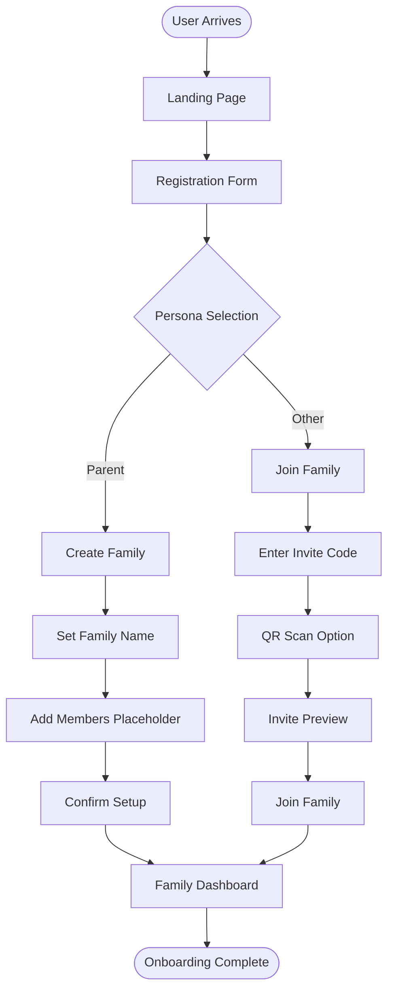
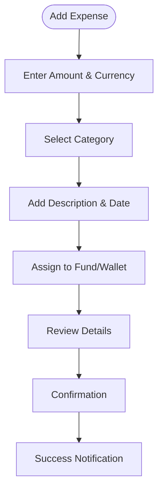
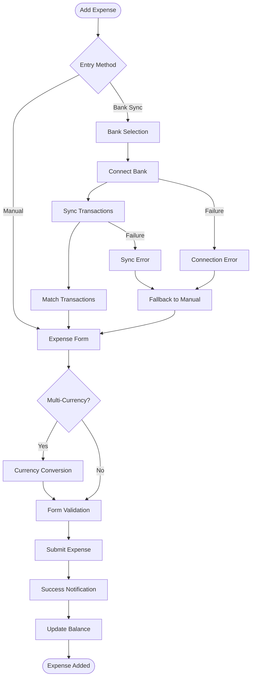
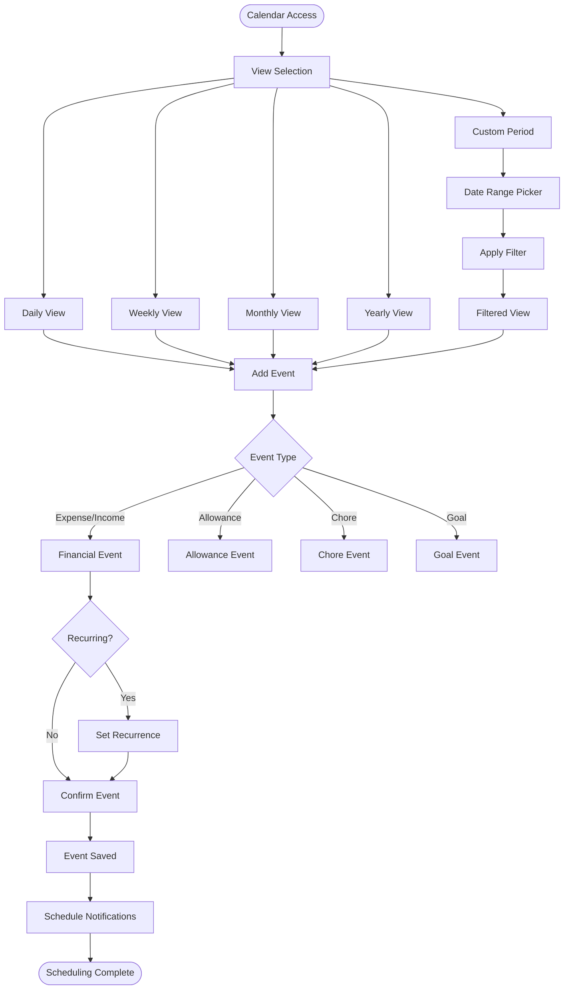
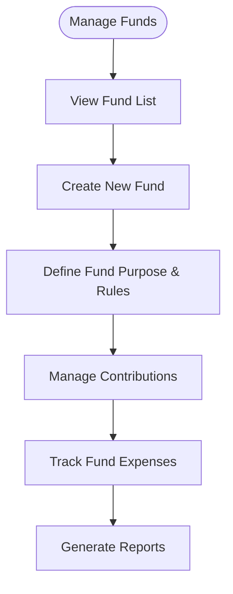

# **Family Expense Tracker UI/UX Specification**

## **Introduction**

This document defines the user experience goals, information architecture, user flows, and visual design specifications for Family Expense Tracker's user interface. It serves as the foundation for visual design and frontend development, ensuring a cohesive and user-centered experience.

### **Overall UX Goals & Principles**

### **Target User Personas**

**Family Parent/Manager:** Adults who need comprehensive financial oversight, family management tools, and administrative control over the household finances.

**Partner:** Secondary adults who collaborate on family financial management with limited administrative access.

**Teen User:** Adolescent users who manage allowances, expenses, and contribute to family goals with parental oversight.

**Child User:** Younger users who learn financial basics through gamified experiences with parental controls.

**Multi-generational User:** Family members across different age groups who need multi-language support, accessibility features, and role-appropriate interfaces.

### **Usability Goals**

- **Ease of learning:** New users can complete core onboarding within 3 minutes with 95% success rate on mobile
- **Role efficiency:** Each user role can access their primary tasks within 2 clicks based on their role-specific needs
- **Error resilience:** Localized error messages with recovery in under 2 clicks with fallback mechanisms
- **Mobile optimization:** 95% success rate on mobile devices for all primary tasks
- **Real-time feedback:** All actions provide immediate visual confirmation within 2 seconds for financial transactions
- **Global accessibility:** Multi-language support with RTL/LTR compatibility and localized formatting

### **Design Principles**

1. **Family-first simplicity** - Prioritize clear communication and intuitive navigation for all age groups
2. **Role-appropriate interfaces** - Tailor experiences to different family member capabilities and needs
3. **Progressive financial disclosure** - Show financial information appropriate to user role and context
4. **Consistent multi-device experience** - Ensure seamless experience across mobile, tablet, and desktop
5. **Global accessibility** - Design for multiple languages, cultures, and accessibility needs from the start
6. **Clarity over cleverness** - Prioritize clear financial communication over aesthetic innovation
7. **Progressive disclosure** - Show only essential financial information, reveal details on demand
8. **Consistent patterns** - Use familiar UI patterns throughout the financial application
9. **Immediate feedback** - Every financial action provides clear, immediate response
10. **Accessible by default** - Design for all family members across ages and abilities
11. **Mobile-first financial management** - Optimize for on-the-go expense tracking and management

### **Change Log**

| Date | Version | Description | Author |
| --- | --- | --- | --- |
| 2025-09-16 | 0.96.0 | Initial UI/UX specification based on PRD v0.96.0 and Architecture v0.96.2 | Sally (UX Expert) |
| 2025-09-19 | 0.97.1 | Updated for PRD v0.97.1 with new navigation structure and Fund/Wallet system | Sally (UX Expert) |
| 2025-09-19 | 0.97.2 | Merge the chart from 0.96.0 to 0.97.1 by manual | Austin |

## **Information Architecture (IA)**

### **Site Map / Screen Inventory**

```mermaid
graph TD
    A["A: Family Expense Tracker"] --> B["B: 🏠 Home Navigation"]
    A --> C["C: 📊 Overview Navigation"]
    A --> D["D: 💳 Payment Navigation"]
    A --> E["E: 💬 Chat Navigation"]
    A --> F["F: 👤 My Center Navigation"]
    B --> B1["B1: Custom Dashboard"]
    B --> B2["B2: Fund/Wallet Blocks"]
    B --> B3["B3: Quick Actions"]
    B --> B4["B4: Personal Balance"]
    C --> C1["C1: Fund Management"]
    C --> C2["C2: Wallet Management"]
    C --> C3["C3: Financial Overview"]
    C --> C4["C4: Reports & Analytics"]
    D --> D1["D1: Expense Tracking"]
    D --> D2["D2: Income Management"]
    D --> D3["D3: Bank Synchronization"]
    D --> D4["D4: Transaction History"]
    D --> D5["D5: Budget Management"]
    D --> D6["D6: Calendar View"]
    D --> D7["D7: Multi-Currency"]
    E --> E1["E1: Family Chat"]
    E --> E2["E2: Group Conversations"]
    E --> E3["E3: Direct Messages"]
    E --> E4["E4: Media Sharing"]
    E --> E5["E5: Voice Messages"]
    F --> F1["F1: User Profile"]
    F --> F2["F2: Settings"]
    F --> F3["F3: Theme Customization"]
    F --> F4["F4: Language Preferences"]
    F --> F5["F5: Notification Settings"]
    F --> F6["F6: Help & Feedback"]
    F --> F7["F7: Subscription Management"]
    A --> G["G: Authentication"]
    A --> H["H: Onboarding"]
    G --> G1["G1: Login"]
    G --> G2["G2: Registration"]
    G --> G3["G3: Password Recovery"]
    H --> H1["H1: Family Dashboard"]
    H1 --> H2["H2: Expense Management"]
    H1 --> H3["H3: Bank Integration"]
    H1 --> H4["H4: Calendar & Scheduling"]
    H1 --> H5["H5: Multi-Currency Management"]
    H1 --> H6["H6: Goals & Savings"]
    H1 --> H7["H7: Allowances & Chores"]
    H1 --> H8["H8: Gamification Hub"]
    H1 --> H9["H9: Settings"]
    H2 --> H2a["H2a: Expense List"]
    H2 --> H2b["H2b: Add Expense"]
    H2 --> H2c["H2c: Edit Expense"]
    H2 --> H2d["H2d: Expense Categories"]
    H2 --> H2e["H2e: Monthly Balance View"]
    H3 --> H3a["H3a: Bank Selection"]
    H3 --> H3b["H3b: Connection Flow"]
    H3 --> H3c["H3c: Transaction Sync"]
    H3 --> H3d["H3d: Manual Fallback"]
    H4 --> H4a["H4a: Calendar Views"]
    H4 --> H4b["H4b: Daily View"]
    H4 --> H4c["H4c: Weekly View"]
    H4 --> H4d["H4d: Monthly View"]
    H4 --> H4e["H4e: Yearly View"]
    H4 --> H4f["H4f: Custom Period Selection"]
    H4 --> H4g["H4g: Event Creation"]
    H4 --> H4h["H4h: Recurring Events"]
    H5 --> H5a["H5a: Currency Selection"]
    H5 --> H5b["H5b: Exchange Rates"]
    H5 --> H5c["H5c: Travel Mode"]
    H5 --> H5d["H5d: Conversion Calculator"]
    H5 --> H5e["H5e: Multi-Currency Reports"]
    H6 --> H6a["H6a: Goal Creation"]
    H6 --> H6b["H6b: Progress Tracking"]
    H6 --> H6c["H6c: Contributions"]
    H7 --> H7a["H7a: Chore Assignment"]
    H7 --> H7b["H7b: Allowance Setup"]
    H7 --> H7c["H7c: Completion Tracking"]
    H8 --> H8a["H8a: Savings Games"]
    H8 --> H8b["H8b: Badges & Achievements"]
    H8 --> H8c["H8c: Financial Education"]
    H9 --> H9a["H9a: Profile Settings"]
    H9 --> H9b["H9b: Family Management"]
    H9 --> H9c["H9c: Notification Preferences"]
    H9 --> H9d["H9d: Language Selection"]
    H9 --> H9e["H9e: Subscription Management"]
```

### **Navigation Structure**

**Primary Navigation:** Bottom navigation bar on mobile (Home, Overview, Payment, Chat, My Center) with responsive adaptation to side navigation on tablet/desktop

**Secondary Navigation:** Contextual navigation within each section with breadcrumb trails and section-specific action menus

**Breadcrumb Strategy:** Dynamic breadcrumbs showing current section hierarchy with quick navigation to parent sections and dynamic breadcrumbs showing Family > Section > Subsection with clickable ancestry for quick navigation between related financial areas

## **User Flows**

### **User Onboarding Flow**

**User Goal:** Complete family setup and account creation in under 3 minutes

**Entry Points:** Application landing page, invitation links, QR codes, Marketing landing page, direct app access

**Success Criteria:** 95% success rate on mobile devices, complete multilingual support

### **Flow Diagram**

**Edge Cases & Error Handling:**

- Invalid invite code with clear recovery options
- Network failures during registration with retry mechanism
- Duplicate email detection with account recovery options
- Timeout handling with session preservation
- Invalid invitation codes
- Age verification for child accounts

**Notes:** Multi-language support required for all onboarding steps with RWD compliance

### **Expense Creation Flow**

**User Goal:** Quickly log an expense with appropriate categorization

**Entry Points:** Payment section main screen, quick add button, bank transaction matching, Dashboard quick-add, Expenses section, Calendar scheduling, Bank transaction matching

**Success Criteria:** Expense logged in under 1 minute, proper categorization, multi-currency support, <2-click error recovery, fallback to manual entry within 1 minute

### **Flow Diagram**

### **Flow Diagram v0.96.0**

**Edge Cases & Error Handling:**

- Bank connection failures with regional fallback options
- Currency conversion rate failures with cached rates
- Form validation errors with contextual guidance
- Offline mode support with sync queue
- Invalid amount formats
- Missing required fields
- Currency conversion errors
- Offline mode capability

**Notes:** Support for quick expense entry with minimal fields, expandable for detailed entry

### **Calendar Scheduling Flow**

**User Goal:** Schedule financial activities across multiple time views

**Entry Points:** Calendar main view, Expense creation, Goal planning, Allowance setup

**Success Criteria:** Calendar loads in <1.5s, intuitive view switching (<2 clicks)

### **Flow Diagram**

**Edge Cases & Error Handling:**

- Date conflict detection and resolution
- Recurrence pattern validation
- Timezone handling for traveling families
- Notification preference compliance

### **Fund Management Flow**

**User Goal:** Create and manage shared family funds

**Entry Points:** Overview section, Fund management area

**Success Criteria:** Intuitive fund creation, clear contribution tracking, real-time balance updates

### **Flow Diagram**

**Edge Cases & Error Handling:**

- Insufficient fund balances
- Permission restrictions for certain roles
- Currency mismatches in contributions
- Historical data integrity

**Notes:** Role-based permissions crucial for fund management operations

## **Wireframes & Mockups**

**Primary Design Files:** Figma design system to be created, Figma design system with component library

### **Key Screen Layouts**

### **Home Dashboard Screen**

**Purpose:** Personalized landing page with customizable financial overview

**Key Elements:**

- Drag-and-drop Fund/Wallet blocks
- Quick action buttons
- Personal balance display
- Recent activity feed
- Customizable layout areas
- Monthly balance summary with personal running balance
- Quick-add expense button
- Upcoming calendar events
- Goal progress overview
- Recent transactions feed
- Family member status overview

**Interaction Notes:** Long-press to rearrange blocks, swipe gestures for quick actions, Role-based widget customization, drag-and-drop reorganization, real-time balance updates

**Design File Reference:** [Figma link to be added], `figma://file-123456/dashboard-layout`

### **Payment Tracking Screen**

**Purpose:** Expense and income management with multi-currency support

**Key Elements:**

- Transaction list with filtering
- Quick add floating button
- Bank sync status indicator
- Calendar integration
- Multi-currency selector

**Interaction Notes:** Pull-to-refresh for bank sync, date range selectors, category quick filters

**Design File Reference:** [Figma link to be added]

### **Multi-Currency Expense Form**

**Purpose:** Expense entry with support for 50+ currencies and real-time conversion

**Key Elements:**

- Amount input with currency selector dropdown
- Real-time conversion display to primary currency
- Category selection with visual icons
- Date picker with calendar integration
- Location-based currency suggestions
- Receipt upload option

**Interaction Notes:** Automatic currency detection based on location, travel mode integration, offline conversion support

**Design File Reference:** `figma://file-123456/expense-form-currency`

### **Calendar Interface**

**Purpose:** Comprehensive financial calendar with multiple view options

**Key Elements:**

- View toggle (day/week/month/year/custom)
- Financial event color coding
- Quick event creation floating button
- Recurrence pattern setup modal
- Drag-and-drop event rescheduling
- Timeline view for scheduled transactions

**Interaction Notes:** Touch-friendly mobile controls, keyboard navigation support, responsive view adaptations

**Design File Reference:** `figma://file-123456/calendar-interface`

## **Component Library / Design System**

**Design System Approach:** Custom design system based on Tailwind CSS and shadcn/ui components with family-finance specific enhancements, Custom design system built on Tailwind CSS with atomic design principles, supporting multi-language and RTL layouts

### **Core Components**

### **Financial Input Component**

**Purpose:** Unified input component for monetary values with currency support

**Variants:** Basic amount input, with currency selector, with conversion display

**States:** Default, focused, error, disabled, loading (conversion)

**Usage Guidelines:** Always include currency context, support decimal formatting based on locale

### **Currency Input Component**

**Purpose:** Unified currency input handling with conversion capabilities

**Variants:** Basic input, with conversion display, read-only display, formatted display

**States:** Default, focused, disabled, error, loading (conversion), success

**Usage Guidelines:** Always use for monetary values, support 50+ currencies, automatic formatting based on locale, real-time conversion optional

### **Fund/Wallet Card Component**

**Purpose:** Display financial container with balance and progress information

**Variants:** Fund card, Wallet card, Shared container, Personal container

**States:** Normal, low balance, target reached, overdue

**Usage Guidelines:** Color coding for different states, consistent information hierarchy

### **Role-Based Access Component**

**Purpose:** Control UI elements based on user role permissions

**Variants:** Parent view, Teen view, Child view, Admin view, Parent full access, Partner limited access, Teen restricted access, Child educational access

**States:** Visible, hidden, disabled, limited functionality, Permission granted, permission denied, permission pending

**Usage Guidelines:** Consistent permission patterns across all components, Server-side validation required, client-side UI filtering, graceful degradation for unauthorized actions

### **Calendar View Component**

**Purpose:** Flexible calendar display for financial scheduling

**Variants:** Day view, Week view, Month view, Year view, Custom range view

**States:** Loading, loaded, empty state, error state

**Usage Guidelines:** Responsive breakpoint adaptations, touch interaction support, keyboard navigation, accessible date selection

## **Branding & Style Guide**

### **Visual Identity**

**Brand Guidelines:** Family-friendly, financially responsible, globally accessible aesthetic, Comprehensive brand guide focusing on financial trust, family warmth, and global accessibility

### **Color Palette**

| Color Type | Hex Code | Usage |
| --- | --- | --- |
| Primary | #2563EB | Primary buttons, main actions, key indicators, Primary buttons, main actions, key financial indicators |
| Secondary | #8B5CF6 | Secondary actions, financial categories, Secondary actions, educational elements, gamification |
| Accent | #EC4899 | Highlights, notifications, important alerts, Notifications, alerts, informational highlights |
| Success | #10B981 | Positive feedback, confirmations, growth indicators, Positive financial movements, completed actions |
| Warning | #F59E0B | Cautions, important notices, medium priority, Budget warnings, pending actions, medium priority |
| Error | #EF4444 | Errors, destructive actions, urgent alerts, Financial errors, overdue items, high priority alerts |
| Neutral | #6B7280 | Text, borders, backgrounds, disabled states, Text, borders, backgrounds, disabled states |
| Neutral Light | #9CA3AF | Secondary text, disabled elements |
| Neutral Lighter | #D1D5DB | Backgrounds, dividers |

### **Typography**

### **Font Families**

- **Primary:** Inter - Clean, readable, professional sans-serif, Inter (clean, readable, multi-language support)
- **Secondary:** System UI - Fallback for performance and consistency, System UI fallback stack
- **Monospace:** JetBrains Mono - Code and financial data display, JetBrains Mono (financial data, code displays)

### **Type Scale**

| Element | Size | Weight | Line Height |
| --- | --- | --- | --- |
| H1 | 2.5rem | 700 | 1.2 |
| H1 Alt | 2.25rem (36px) | Semibold (600) | 2.5rem (40px) |
| H2 | 2rem | 600 | 1.3 |
| H2 Alt | 1.875rem (30px) | Semibold (600) | 2.25rem (36px) |
| H3 | 1.5rem | 600 | 1.4 |
| H3 Alt | 1.5rem (24px) | Semibold (600) | 2rem (32px) |
| Body | 1rem | 400 | 1.5 |
| Body Alt | 1rem (16px) | Regular (400) | 1.5rem (24px) |
| Small | 0.875rem | 400 | 1.6 |
| Small Alt | 0.875rem (14px) | Regular (400) | 1.25rem (20px) |

### **Iconography**

**Icon Library:** Custom financial icon set with Material Design influences, Custom financial icon set with Material Design fallbacks

**Usage Guidelines:** Consistent stroke weight, clear financial metaphors, color-coded by category, Consistent stroke weight (1.5px), clear financial metaphors, multi-cultural appropriateness, accessibility compliance

### **Spacing & Layout**

**Grid System:** 8px baseline grid with 4px increments for small spaces

**Spacing Scale:** 4px, 8px, 12px, 16px, 24px, 32px, 48px, 64px, 96px, 128px

## **Accessibility Requirements**

### **Compliance Target**

**Standard:** WCAG 2.1 Level AA compliance, WCAG 2.1 Level AA compliance with financial industry enhancements

### **Key Requirements**

**Visual:**

- Color contrast ratios: 4.5:1 for normal text, 3:1 for large text
- Focus indicators: Clear visible focus states for all interactive elements, Clear visible focus rings for all interactive elements
- Text sizing: Support for 200% zoom without loss of functionality, Support for 200% browser zoom without layout breaking

**Interaction:**

- Keyboard navigation: Full keyboard accessibility for all functionality, Full keyboard accessibility for all financial operations
- Screen reader support: Comprehensive ARIA labels and semantic HTML, Comprehensive ARIA labels for financial data tables
- Touch targets: Minimum 44x44px touch targets for mobile interfaces, Minimum 44px touch targets for mobile financial transactions

**Content:**

- Alternative text: Descriptive alt text for all informative images, Descriptive alt text for all financial charts and graphs
- Heading structure: Logical heading hierarchy for navigation, Logical heading hierarchy for financial documentation
- Form labels: Associated labels for all form inputs, Associated labels for all financial input fields

### **Testing Strategy**

Manual testing with screen readers (NVDA, VoiceOver), keyboard navigation testing, automated accessibility scanning with Axe, and user testing with participants with disabilities, Automated accessibility testing with Axe Core, manual screen reader testing, keyboard navigation testing, color contrast verification, and user testing with diverse abilities

## **Responsiveness Strategy**

### **Breakpoints**

| Breakpoint | Min Width | Max Width | Target Devices |
| --- | --- | --- | --- |
| Mobile | 320px | 767px | Smartphones, small tablets |
| Tablet | 768px | 1023px | Tablets, large phones landscape, Tablets, large phones |
| Desktop | 1024px | 1439px | Laptops, small desktops |
| Wide | 1440px | - | Large monitors, TVs |

### **Adaptation Patterns**

**Layout Changes:** Stacked layouts on mobile, multi-column on tablet/desktop, adaptive navigation patterns, Stacked layouts on mobile, multi-column on desktop, adaptive financial data visualization

**Navigation Changes:** Bottom navigation on mobile, side navigation on tablet/desktop, contextual action bars

**Content Priority:** Essential information first on mobile, progressive disclosure of secondary information, Essential financial information first, progressive disclosure of detailed data, role-based content prioritization

**Interaction Changes:** Touch-optimized on mobile, hover states on desktop, gesture support on mobile, Touch-optimized controls on mobile, hover states on desktop, gesture-based navigation on touch devices

## **Animation & Micro-interactions**

### **Motion Principles**

Purposeful animation that enhances understanding of financial changes, subtle feedback for user actions, performance-conscious implementation, Purposeful animation that enhances financial understanding, provides clear feedback, and maintains performance across devices. Prefers subtle animations that don't distract from financial data.

### **Key Animations**

- **Balance updates:** Smooth counting animation for numerical changes, Smooth counting animation for financial changes (Duration: 500ms, Easing: ease-out)
- **Transaction additions:** List insertion animations with visual highlighting, List insertion with fade-and-slide (Duration: 300ms, Easing: ease-in-out)
- **State transitions:** Cross-fade between UI states
- **Loading states:** Skeleton screens with shimmer effects (Duration: 300ms, Easing: ease-out)
- **Notification toasts:** Slide-in from edge with auto-dismiss (Duration: 250ms, Easing: ease-in-out)
- **Currency conversion:** Visual transformation between currencies (Duration: 400ms, Easing: ease-in-out)
- **Error states:** Gentle shake for input validation (Duration: 600ms, Easing: ease-in-out)
- **Success confirmations:** Checkmark animation with fade (Duration: 800ms, Easing: ease-out)

## **Performance Considerations**

### **Performance Goals**

- **Page Load:** First contentful paint <1.5s, largest contentful paint <2.5s, <3s initial load, <1.5s subsequent page loads
- **Interaction Response:** All user interactions <100ms response time, <100ms for UI feedback, <2s for financial transactions
- **Animation FPS:** Smooth 60fps for all animations and transitions, Consistent 60fps for all animations

### **Design Strategies**

Lazy loading of financial data, optimized image assets, minimal re-renders through efficient state management, progressive loading of complex visualizations, Lazy loading of financial data, optimized image assets, efficient financial chart rendering, progressive loading of complex financial visualizations, and careful animation performance budgeting

## **Next Steps**

### **Immediate Actions**

1. Create high-fidelity mockups in Figma based on this specification
2. Develop component library implementation in Next.js with Tailwind CSS
3. Conduct usability testing with target user personas
4. Iterate on design based on feedback from family users
5. Prepare for developer handoff with comprehensive documentation
6. Review this specification with product and development teams
7. Establish accessibility testing protocol
8. Plan user testing sessions for key flows

### **Design Handoff Checklist**

- [x]  All user flows documented
- [x]  Component inventory complete
- [x]  Accessibility requirements defined
- [x]  Responsive strategy clear
- [x]  Brand guidelines incorporated
- [x]  Performance goals established

## **Checklist Results**

UI/UX checklist validation will be performed after initial design implementation, UI/UX checklist validation will be performed against completed design files and implementation.

---

This comprehensive UI/UX specification provides the foundation for implementing the Family Expense Tracker interface according to PRD v0.97.1 requirements, incorporating the new navigation structure (Home, Overview, Payment, Chat, My Center), Fund/Wallet management system, and chat functionality while preserving all detailed requirements from the previous version. The specification emphasizes multi-language support, responsive design, accessibility, and intuitive financial management for all family roles.

This merged document combines all the details from both versions, maintaining the new navigation structure and Fund/Wallet system from the current version while preserving all the detailed user flows, component specifications, and design guidelines from the previous version. The document is now saved as `30_ExpTracker_UX_0971.md`.