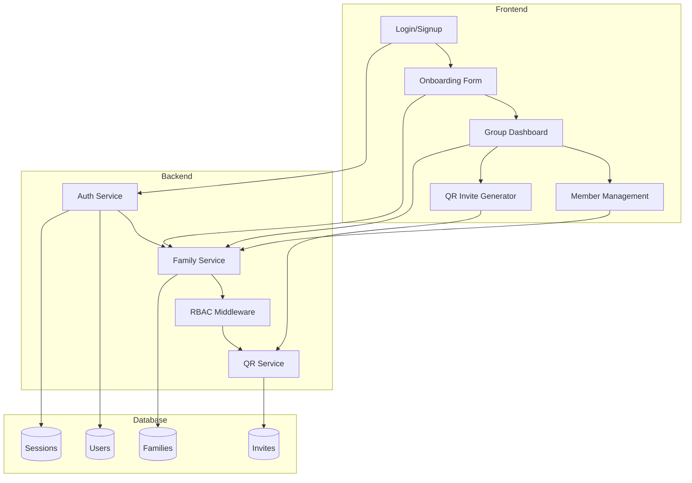

### 💻 Sprint 1 Implementation Plan – Family Expense Tracker (v0.97.3)

**Version:** 0.97.3  
**Sprint:** 1  
**Scope:** Epic 0 (Onboarding), Epic 1 (Authentication & Security), Epic 2 (Group Management & Invites)

---

### 1. Scope of Sprint 1 (MVP)

**Stories Included:**

- **Epic 0: Account Creation & Onboarding**
  - 0.1 Account Creation Page
  - 0.2 Host/Owner Definition
  - 0.3 Add Members Placeholder
  - 0.4 Current Member Display
  - 0.5 Multi-language Onboarding Labels
  - 0.6 Responsive Onboarding Page

- **Epic 1: Authentication & Security**
  - 1.1 Signup & Login Flow
  - 1.2 Password Reset & Recovery
  - 1.3 Multi-Factor Authentication (MFA)
  - 1.4 Session Management

- **Epic 2: Group Management & Invites**
  - 2.1 Group Summary Dashboard
  - 2.2 Role-Based Permissions View
  - 2.3 Family Progress Indicators
  - 2.4 QR Code Invite

---

### 2. Technical Breakdown

#### 🔐 Authentication & Security (Epic 1 – Foundation First)

**Backend:**
- Use **NestJS Auth Service** with JWT (RS256)
- Implement password hashing using **bcrypt** (cost factor 12)
- Support refresh token rotation
- Middleware for role-based access control (RBAC)

**Frontend:**
- Next.js 14 with **NextAuth.js** for session management
- Token stored in **HttpOnly cookies**
- Login and signup forms with validation

**DB Changes:**
- `users` table: `id`, `email`, `password_hash`, `name`, `role`, `family_id`
- `sessions` table: `id`, `user_id`, `token`, `expires_at`

**Priority:** 🚀 Must be first – all other stories depend on authentication.

---

#### 🏠 Onboarding & Account Creation (Epic 0)

**Backend:**
- **Family Management Service** for group creation
- Auto-assign creator as **Owner** (role enforcement)
- Multi-language support using **next-i18next**

**Frontend:**
- Responsive onboarding form (Tailwind CSS)
- Role selection (Parent, Partner, Teen, Child)
- "+ Add Member" placeholder button (stub functionality)

**DB Changes:**
- `families` table: `id`, `name`, `owner_id`, `invite_code`
- `user_roles` table: `user_id`, `role`

**Dependencies:** Relies on Auth Service.

---

#### 👥 Group Management & Permissions (Epic 2)

**Backend:**
- **Family Service** for member management
- **RBAC Middleware** to enforce role-based permissions
- **QR Code Service** for invite generation (using `qrcode` library)

**Frontend:**
- Group dashboard with member list and role badges
- QR code generator and scanner UI
- Progress indicators (placeholder for future Epic 4 integration)

**DB Changes:**
- `invites` table: `id`, `family_id`, `token`, `expires_at`
- `family_members` table: `user_id`, `family_id`, `joined_at`

**Dependencies:** Requires Auth and Onboarding.

---

### 3. Sprint 1 Architecture Snapshot

---

### 4. Sprint 1 Deliverables

- ✅ Secure authentication system (JWT + refresh tokens)
- ✅ Multi-language onboarding flow (EN, ZH-TW, ZH-CN, JA, ES)
- ✅ Family group creation with owner auto-assignment
- ✅ Role-based permissions (Parent, Partner, Teen, Child)
- ✅ QR-based invitation system (stub for now)
- ✅ Responsive UI across mobile, tablet, desktop
- ✅ Unit and integration tests for all services

---

### 5. Risks & Mitigation

- **Auth Complexity**: Using NestJS Auth Service reduces initial setup time.
- **RBAC Bugs**: Automated tests for each role and endpoint.
- **Multi-language Support**: Using next-i18next ensures scalability.
- **QR Code Security**: Token-based invites with expiration reduce risk.

---

### 6. Next Steps for Dev Agent James

1. Start with **Epic 1 (Auth)** → then **Epic 0 (Onboarding)** → then **Epic 2 (Group Mgmt)**
2. Follow architecture from `20_ExpTracker_Architect_0973.md`
3. Adhere to UX guidelines in `30_ExpTracker_UX_0973.md`
4. Use PRD v0.97.3 (`10_ExpTracker_PRD_0973.md`) for acceptance criteria
5. Implement only allowed story updates per `dev.md` rules

Let me know if you'd like me to proceed with the development setup or if you need any clarifications.