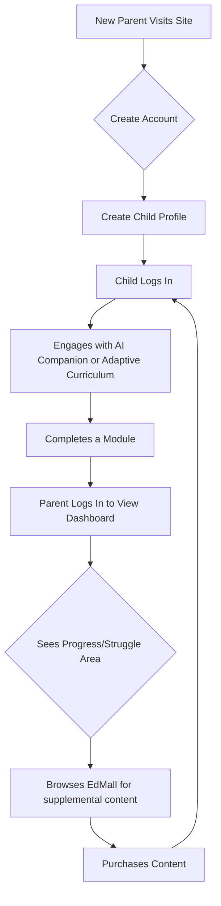

# 1. Document Information
1.1 Version History

v1.0 (2025-08-09): Initial draft created.

1.2 Document Purpose

This document details the product requirements for KidsMate version 0.80.1. It defines the product's goals, features, and functionalities to guide the design, development, and testing teams.

1.3 Related Documents Reference

docs/Roadmap.md
docs/User_Story_Map.md

docs/Metrics_Framework.md

## 2. Product Overview
2.1 Product Name and Positioning

Product Name: KidsMate 0.80.1.

Positioning: KidsMate is a comprehensive, AI-powered educational platform designed for children. It uniquely combines an interactive AI companion, a marketplace for diverse educational content, and a detailed parental evaluation dashboard to create a personalized and adaptive learning ecosystem.

2.2 Product Vision and Mission

Vision: To make personalized and engaging education accessible to every child, adapting to their unique learning style and pace.

Mission: To empower children by providing an interactive AI learning companion, support parents with actionable insights into their child's progress, and foster a rich ecosystem of high-quality educational content.

2.3 Value Proposition and Unique Selling Points (USP)

KidsMate's core value is delivering a holistic and adaptive learning experience. Its USPs are:

Real-time AI Companion: A supportive chatbot that provides instant, interactive help to students whenever they need it.

EdMall: An innovative digital marketplace where parents and educators can browse and purchase educational content from a variety of suppliers, conceptualized as different "stores".

Evaluation Dashboard: A comprehensive dashboard for parents to monitor their child's learning journey through formative and summative evaluations, enabling them to coach at the right moment.

Adaptive Learning: Specialized support for students with special needs through expert differentiation, pushing tailored study materials directly to the individual's learning front page.

2.4 Target Platform List

Primary: Web Application (Desktop and Mobile Web)

Future Consideration: Native iOS and Android applications.

2.5 Product Core Assumptions

Parents actively seek personalized digital learning tools that offer more than a one-size-fits-all curriculum.

Children's engagement and learning retention increase when using interactive, AI-driven tools compared to static content.

A marketplace model will attract high-quality, diverse curriculum suppliers, creating a richer content library.

Parents desire transparent, data-driven insights into their child's academic performance to provide effective support.

2.6 Business Model Overview

The platform will operate on a hybrid model:

Freemium/Subscription: Core features may be free, while advanced functionalities (e.g., in-depth analytics on the Evaluation Dashboard, unlimited AI chat) will require a subscription.

Marketplace Commission: A percentage fee will be taken from each transaction conducted within the EdMall between users and curriculum suppliers.

## 3. User Research
3.1 Target User Personas

Persona 1: The Student (Chloe, age 8)

Demographics: Elementary school student.

Behavior: Enjoys interactive games and videos. Gets easily distracted with traditional homework. Uses a family tablet for learning and entertainment.

Needs & Pain Points: Needs instant help when stuck on a problem; feels shy about asking the teacher questions in front of the class. Finds standard lessons boring.

Motivation: Wants to feel confident in her knowledge and have fun while learning.

Persona 2: The Parent (David, age 42)

Demographics: Father of two, working full-time.

Behavior: Proactively involved in his children's education. Spends evenings and weekends helping with homework. Researches educational tools online.

Needs & Pain Points: Worries his child isn't getting enough personalized attention at school. Struggles to find high-quality, engaging educational content. Doesn't have a clear way to track learning progress beyond report cards.

Motivation: Wants to ensure his child is on track and to provide the best resources for their success and development.

3.2 User Scenario Analysis

Core Scenario 1: Chloe is doing her math homework and encounters a difficult problem. She opens KidsMate, asks the AI Companion for a hint, and receives a step-by-step explanation that helps her solve it.

Core Scenario 2: David receives a weekly summary email from KidsMate. He logs into the Evaluation Dashboard and sees that Chloe has excelled in multiplication but struggled with fractions. The dashboard suggests a specific content module from the EdMall focused on fraction fundamentals. He purchases it.

Edge Scenario: A curriculum supplier logs in to their EdMall portal to upload new learning modules and track their sales performance for the month.

## 4. Market & Competitor Analysis
4.1 Market Size & Growth Prediction

The global EdTech market is a multi-billion dollar industry with sustained growth, further accelerated by the increasing adoption of remote and hybrid learning models. The K-12 segment, especially adaptive learning, shows significant investment and innovation.

4.2 Industry Trend Analysis

Personalization & AI: A major trend is the shift from static content to AI-driven adaptive learning paths that cater to individual student needs.

Gamification: Incorporating game-like elements to increase student engagement is standard.

Parental Involvement: Platforms are increasingly providing tools for parents to monitor and participate in the learning process.

4.3 Competitor Analysis

Direct Competitors: Khan Academy Kids, ABCmouse, IXL Learning.

Indirect Competitors: General content platforms like YouTube Kids, and specialized learning apps like Duolingo (for languages).

4.4 Competitor Function Comparison Matrix

| Feature                          | KidsMate | Khan Academy Kids | ABCmouse | IXL Learning |
| -------------------------------- | -------- | ----------------- | -------- | ------------ |
| **AI Companion Chatbot**         | ✅        | ❌                 | ❌        | ❌            |
| **Content Marketplace (EdMall)** | ✅        | ❌                 | ❌        | ❌            |
| **Advanced Parent Dashboard**    | ✅        | Basic             | Basic    | ✅            |
| **Adaptive Learning Path**       | ✅        | ✅                 | ✅        | ✅            |
| **Multi-Language Curriculum**    | ✅        | Limited           | ❌        | Limited      |

4.5 Market Differentiation Strategy

KidsMate will differentiate itself by being the only platform that integrates all four key value propositions: an AI-powered personal tutor, a curated content marketplace, a detailed parental dashboard, and specialized adaptive learning. While competitors excel in one or two of these areas, KidsMate’s all-in-one ecosystem provides a more seamless and comprehensive solution for both parents and students.

## 5. Product Functional Requirements
5.1 Functional Architecture

The platform is divided into five main modules:

AI Companion: The real-time chat interface.

EdMall: The e-commerce marketplace for educational content.

Evaluation Dashboard: The analytics and reporting interface for parents.

Learning Core: The system that delivers adaptive curriculum and tracks progress.

Community & Support: User communities and customer service features.

5.2 Core Functional Details

5.2.1 Module: AI Companion

Description: As a student, I want to chat with an AI tutor in real-time, so that I can get immediate help and explanations for subjects I'm struggling with.

User Value: Provides on-demand academic support, building student confidence and reducing learning friction.

Logic & Rules:

The chat interface must be simple and intuitive for a child.

The AI must be able to understand queries in multiple languages (starting with English, Chinese, Japanese).

The AI's responses should be encouraging, age-appropriate, and educationally sound. It should provide hints and guidance rather than direct answers.

All chat logs must be saved and available for parental review on the dashboard.

Acceptance Criteria:

A user can successfully open the chat window.

A user can type a question and receive a relevant, helpful response within 3 seconds.

The chat history is saved and viewable.

5.2.2 Module: EdMall

Description: As a parent, I want to browse a digital mall of educational content from different suppliers, so that I can purchase the best materials to support my child's learning needs.

User Value: Offers a centralized, trusted source for high-quality, diverse educational content, saving parents time and effort.

Logic & Rules:

The EdMall will feature "stores" for each curriculum supplier.

The system must support supplier management (for onboarding and content uploads) and customer management.

A ranking system will be implemented to feature popular or highly-rated study materials.

Secure payment processing is required.

Acceptance Criteria:

A user can browse content by subject, age range, and supplier.

A user can add an item to the cart and complete a mock purchase.

Suppliers can log in to a separate portal to manage their content listings.

5.2.3 Module: Evaluation Dashboard

Description: As a parent, I want to view a dashboard with clear evaluations and rubrics on my child's performance, so that I can monitor their progress and provide timely support.

User Value: Provides parents with actionable insights, turning raw data into a clear picture of their child's strengths and weaknesses.

Logic & Rules:

The dashboard must display key metrics: time spent, modules completed, and scores.

It will feature both summative (e.g., test scores) and formative (e.g., progress over time) evaluation data.

Visualizations (charts, graphs) should be used to make data easily digestible.

Acceptance Criteria:

A parent can log in and view their child's profile.

The dashboard correctly displays data from completed learning activities.

Data visualizations are clear and update in real-time.

5.3 Future Functionality (Backlog)

Gamification elements (badges, points, leaderboards).

Student-to-student interaction within community groups.

Integration with school learning management systems (LMS).

## 6. User Flow & Interaction Design Guidance
6.1 Core User Journey Map

程式碼片段

   
6.2 UI/UX Guidance for Designers

For Children: The interface must be bright, simple, and highly intuitive. Use large, friendly fonts and iconography. Minimize text-heavy instructions. The AI Companion should feel like a friendly character, not just a text box.

For Parents: The dashboard interface must be clean, professional, and data-rich but not overwhelming. Prioritize clarity and ease of navigation. Use clear data visualizations to convey insights quickly.

## 7. Non-Functional Requirements
7.1 Performance: Web pages must load in under 3 seconds. AI chat responses must be delivered in under 3 seconds.

7.2 Security: All user data, especially children's data, must be encrypted at rest and in transit. Must be compliant with child online privacy laws (e.g., COPPA, GDPR-K).

7.3 Usability: The platform must be accessible and usable for individuals with disabilities, adhering to WCAG 2.1 AA standards.

7.4 Data Analytics: The system must track key user events (e.g., lesson start/complete, item purchase, chat query) for product analysis.

## 8. Technical Architecture Considerations
8.1 Tech Stack Suggestion:

Frontend: A modern JavaScript framework like React or Vue.js for a responsive and interactive user experience.

Backend: Python or Node.js to handle business logic, with a framework like Django or Express. Python is well-suited for the AI/ML components.

Database: A combination of a relational database (like PostgreSQL) for structured data (users, purchases) and a NoSQL database (like MongoDB) for less structured data (chat logs, event tracking).

AI/ML: Utilize pre-trained language models (LLMs) and fine-tune them for the educational context. Services like TensorFlow or PyTorch will be essential.

8.2 System Integration: Requires integration with a secure third-party payment gateway (e.g., Stripe, PayPal) for EdMall transactions.

## 9. Acceptance Criteria Summary

| Feature                  | Key Acceptance Criterion                                                     |
| ------------------------ | ---------------------------------------------------------------------------- |
| **User Registration**    | A parent can create an account and a linked child profile successfully.      |
| **AI Companion**         | A child can ask a question and receive an age-appropriate, relevant answer.  |
| **EdMall Browse**        | A user can filter and search for content based on subject and age.           |
| **EdMall Purchase**      | A user can successfully complete a mock transaction.                         |
| **Evaluation Dashboard** | The dashboard accurately reflects the child's activity and performance data. |

## 10. Product Success Metrics
10.1 Key Performance Indicators (KPIs):

Engagement: Daily Active Users (DAU), Average Session Duration.

Academic Progress: Module completion rate, improvement in assessment scores.

Commercial: EdMall conversion rate, Monthly Recurring Revenue (MRR).

Parental Satisfaction: Net Promoter Score (NPS), Parent dashboard login frequency.

10.2 North Star Metric: Weekly Engaged Learning Minutes. This metric captures the core value of the platform: the amount of time children spend actively and successfully learning. It combines user activity (time) with effectiveness (engagement), aligning the entire team towards a single goal.

10.3 Metrics Monitoring: A dedicated analytics dashboard (e.g., using a tool like Amplitude or Mixpanel) will be used to track these KPIs in real-time. The product team will review these metrics weekly.