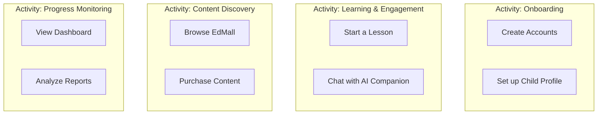

### **1. User Story Map Overview**

This document visualizes the KidsMate user experience by mapping user activities, tasks, and stories. It serves as a backlog and a tool for release planning.

### **2. User Activities & Tasks**

程式碼片段

### **3. Stories by Release**

### **Release 1: MVP**

- **Onboarding**
    - As a new user, I want to sign up as a parent using my email.
    - As a parent, I want to create a profile for my child with their name and age.
- **Learning & Engagement**
    - As a child, I want to select a subject and start a basic lesson.
    - As a child, I want to open a chat window and ask the AI a question.
- **Progress Monitoring**
    - As a parent, I want to log in and see how much time my child has spent on the platform.
    - As a parent, I want to see a list of the lessons my child has completed.

### **Release 2: Version 2.0**

- **Content Discovery**
    - As a parent, I want to search and filter the EdMall for specific topics.
    - As a parent, I want to securely purchase a curriculum module using my credit card.
    - As a content supplier, I want a portal to upload my materials and set a price.
- **Learning & Engagement**
    - As a student, I want the system to suggest easier or harder questions based on my answers.
- **Progress Monitoring**
    - As a parent, I want to see a detailed rubric showing my child's performance against learning objectives.